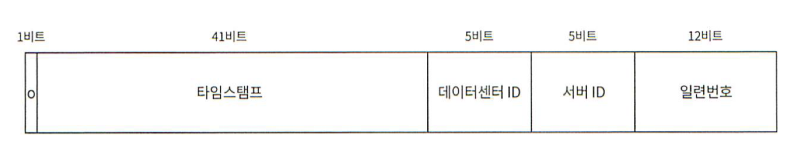

# 7장. 분산 시스템을 위한 유일 ID 설계
이 질문을 받았을 때 auto_increment 속성이 설정된 RDBMS의 기본키를 쓰면 되는게 아닐까? 라고 생각할지도 모르겠다.  
하지만 분산 환경에서 이 접근법은 통하지 않을테고 서버 한대로는 요구를 감당할 수 없을 뿐더러, 여러 DB가 쓰이는 경우에 지연시간을 낮추기가 무척 힘들 것이기 때문이다.

### 1단계. 문제 이해 및 설계 범위 확장
A : ID는 어떤 특성을 갖나요?   
B : 유일해야하고, 정렬 가능해야 합니다.  
A : 새로운 레코드에 붙일 ID는 항상 1만큼 큰 값이어야 하나요?  
B : ID의 값은 시간이 흐름에 따라 커질테지만 언제나 1씩 증가한다고 할 수는 없습니다. 확실한것은 나중에 만들어진 ID가 큰 값을 가집니다.    
A : ID는 숫자로만 구성되나요?  
B : 네.  
A : 시스템 규모는 어느정도인가요?  
B : 초당 1만 ID를 생성할 수 있어야합니다.

### 2단계. 개략적 설계안 제시 및 동의 구하기
분산 시스템에서 유일성이 보장되는 ID를 만드는 방법은 여러가지다.
- 다중 마스터 복제
- UUID
- 티켓 서버
- 트위터 스노플레이크

#### 다중 마스터 복제
이 접근법은 DB의 auto_increment 기능을 활용하는 것이다.  
다만 1만큼 증가시키는 것이 아닌 k만큼 증가시키는 것이다. k는 현재 사용중인 DB 서버의 수이다.  
이렇게 하면 규모 확장성 문제는 어느정도 해결할 수 있는데, DB 서버 수를 늘리면 초당 생산 가능 ID 수도 늘릴 수 있기 때문이다.  
하지만 이 방법은 중대한 단점이 있다.
- 여러 데이터 센터에 걸쳐 규모를 늘리기 어렵다.
- ID의 유일성은 보장되겠지만 그 값이 시간 흐름에 맞추어 커지도록 보장할 수는 없다.
- 서버를 추가하거나 삭제할 때도 잘 동작하도록 만들기 어렵다.

#### UUID
UUID는 유일성이 보장되는 ID를 만드는 간단한 방법이다. UUID는 128비트짜리 수다.  

장점
- 단순하다. 동기화 이슈도 없다.
- 각 서버가 자기가 쓸 UUID를 만드는 구조라 규모 확장도 쉽다.

단점
- 128비트로 길다.
- 시간순으로 정렬할 수 없다.
- 숫자가 아닌 값도 포함될 수 있다.

#### 티켓 서버
핵심은 auto_increment 기능을 갖춘 DB 서버, 즉 티켓 서버를 중앙 집중형으로 하나만 사용하는 것이다.  

장점
- 유일성이 보장되는 오직 숫자로만 구성된 ID를 쉽게 만들 수 있다.
- 구현하기 쉽고, 중소 규모 애플리케이션에 적합하다.

단점
- 티켓 서버가 SPOF(Single Point of Failure)가 된다. 그렇다고 여러대를 준비하면 동기화 문제가 발생한다.

#### 트위터 스노플레이크 접근법

- 사인(sign) 비트 : 1비트를 할당한다. 지금으로서는 쓰임새가 없지만 나중을 위해 유보해 둔다. 음수와 양수를 구분하는 데 사용할 수 있을 것이다.
- 타임스탬프 : 41 비트를 할당한다. 기원 시각 이후로 몇 밀리초가 경과했는지를 나타내는 값이다.
- 데이터 센터 ID : 5비트를 할당한다. 따라서 32개의 데이터 센터를 지원할 수 있다.
- 서버 ID : 5비트를 할당한다. 따라서 데이터 센터당 32개의 서버를 사용할 수 있다.
- 일련번호 : 12비트를 할당한다. 각 서버에서는 ID를 생성할 때마다 일련번호를 1씩 증가시킨다. 이 값은 1밀리초가 경과할 때마다 0으로 초기화된다.

### 3단계. 상세 설계
#### 타임스탬프
타임 스탬프는 앞서 살펴본 ID구조에서 가장 많은 41비트를 차지하고있다.  
시간이 흐름에 따라 점점 큰 값을 갖게 되므로 결국 ID는 시간 순으로 정렬가능하게 될 것이다.  
41비트로 표현할 수 있는 타임스탬프의 최댓값은 대략 69년에 해당한다.  
따라서 이 ID생성기는 69년동안만 정상 동작하는데, 기원 시각을 현재에 가깝게 맞춰 오버플로가 발생하는 시점을 늦춰놓은 것이다.  
69년이 지나면 기원 시각을 바꾸거나 ID 체계를 다른 것으로 이전하여야 한다.

#### 일련번호
일련 번호는 12비트 이므로 4096개의 값을 가질 수 있다. 어떤 서버가 같은 밀리초 동안 하나 이상의 ID를 만들어 낸 경우에만 0보다 큰 값을 갖게 된다.

### 4단계. 마무리
#### 시계 동기화
이번 설계에서 ID 생성 서버들이 전부 같은 시계를 사용한다고 가정하였다. 하지만 이런 가정은 하나의 서버가 여러 코어에서 실행될 경우 유효하지 않을 수 있다.  
여러 서버가 물리적으로 독립된 여러 장비에서 실행되는 경우에도 마찬가지다.  
NTP(Network Time Protocol)은 이 문제를 해결하는 가장 보편적인 수단이다.

#### 각 섹션의 길이 최적화
동시성이 낮고 수명이 긴 애플리케이션이라면 일련번호 절의 길이를 줄이고 타임스탬프절의 길이를 늘리는 것이 효과적일 수 있다.

#### 고가용성
ID 생성기는 필수불가결 컴포넌트이므로 아주 높은 고가용성을 제공해야 할 것이다. 