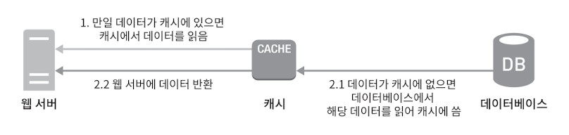
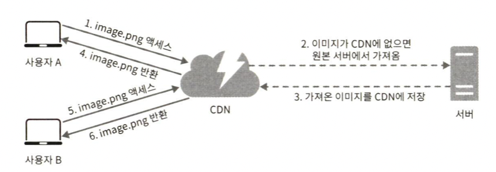

# 1. 사용자 수에 따른 규모 확장성
한 명의 사용자를 지원하는 시스템에서 시작하여, 최종적으로 몇백만 사용자를 지원하는 시스템을 설계해 볼 것이다.

### 1.1. 단일 서버
복잡한 시스템을 만드는 것도 단 한대에서 실행되는 간단한 시스템부터 시작된다.  
먼저 웹 앱, DB, 캐시 등이 한 대의 서버에서 실행되는 구성을 보자.

  
1. 사용자는 도메인을 이용해 웹 사이트에 접속한다.
2. 접속을 위해서는 IP 주소를 알아야하는데 DNS에 질의하여 IP 주소를 변환한다.
3. IP 주소로 HTTP 요청이 전달된다.
4. 요청에 따른 HTML 페이지나 JSON 형태의 응답을 반환한다.

웹 또는 모바일 앱에서 웹 서버로 요청이 온다.

### 1.2. 데이터베이스
사용자가 늘면 서버 하나로는 충분하지 않아 여러 서버를 두어야한다.  
하나는 웹/모바일 트래픽 처리 용도고, 다른 하나는 데이터베이스용이다.  

DB에는 관계형 DB와 비관계형 DB가 있다.  
관계형 DB(RDBMS)에는 MySQL, 오라클, PostgreSQL 등이 있다.  
비관계형 DB(NoSQL)에는 Amazon Dynamo DB, Mongo DB 등이 있다.  

NoSQL은 다시 네 부류로 나눌 수 있다. 
- key-value
- graph
- column
- document

대부분의 개발자에게는 RDBMS가 최선일텐데 40년 이상 시장에서 살아남아 잘 사용되어온 시스템이라서다.  
하지만 다음과 같은 경우는 NoSQL이 바람직한 선택일 수 있다.
- 아주 낮은 응답 지연시간이 요구됨
- 다루는 데이터가 비정형이라 관계형 데이터가 아님
- 데이터(JSON, YAML, XML 등)를 직렬화 하거나 역직렬화 할 수 있기만 하면됨
- 아주 많은 양의 데이터를 저장할 필요가 있음

### 1.3. 수직적 규모 확장 vs 수평적 규모 확장
수직적 규모 확장(Scale-Up)
- 스케일 업에는 한계가 있다. 한 대의 서버에 CPU나 메모리를 무한대로 증설할 방법은 없다.
- 장애에 대한 자동복구 방안이나 다중화 방안을 제시하지 않는다. 서버에 장애가 발생하면 웹/앱은 완전히 중단된다.

이러한 단점 때문에 애플리케이션을 지원하는 데는 수평적 규모 확장법(Scale-Out)이 적절하다.  
앞서 본 설계에서 사용자는 웹 서버에 바로 연결된다. 웹 서버가 다운되면 사용자는 웹 사이트에 접속할 수 없다.  
또한 너무 많은 사용자가 접속하여 웹 서버가 한계 상황에 도달하게 되면 응답 속도가 느려지거나 서버 접속이 불가능해질 수도 있다.  
이런 문제를 해결하는 데는 부하 분산기 또는 로드밸런서를 도입하는 것이 최선이다.

로드밸런서  
  
- 로드밸런서는 트래픽 부하를 고르게 분산하는 역할을 한다.
- 웹 서버는 클라이언트의 접속을 직접 처리하지 않는다.
- 보안을 위해 서버간 통신에는 private IP 주소가 이용된다.
- 서버1이 다운되면 모든 트래픽은 서버2로 전송된다. 따라서 웹 사이트 전체가 다운되는 일이 방지된다.
- 트래픽이 증가하면 더 많은 서버를 추가하기만 하면 된다.

DB 다중화  

- 많은 DB 관리 시스템이 다중화를 지원한다. 주(master)-부(slave) 관계를 설정하고 원본은 주 서버에, 사본은 부 서버에 저장한다.
- 쓰기 연산은 주 서버에서만 지원하고, 부 서버는 사본을 전달받아 읽기연산만을 지원한다. 읽기 연산이 쓰기 연산보다 비중이 훨씬 높기 때문이다.
- 위와 같이 구성하면 병렬로 처리되어 성능도 좋아지고 일부 서버가 파괴되어도 데이터는 보존되어 안전하고, 다른 서버를 사용할 수 있어 가용성이 높아진다.
- 부 서버가 한 대 뿐인데 다운된다면 읽기 연산은 주 서버로 전달된다. 부 서버가 여러대인 경우는 나머지 부 서버들로 분산 될 것이다.
- 주 서버가 다운된다면 한 대의 부 서버가 있는 경우는 해당 서버가 주 서버가 될 것이고, 여러 부 서버가 있다면 하나의 부 서버가 주 서버로 될 것이다.

- 사용자는 DNS로부터 로드밸런서의 public IP 주소를 받는다.
- 사용자는 해당 IP 주소를 사용해 로드밸런서에 접속한다.
- HTTP 요청은 서버1 또는 서버2로 전달된다.
- 웹 서버는 사용자의 데이터를 부 DB 서버에서 읽는다.
- 웹 서버는 데이터 변경 연산은 주 DB 서버로 전달한다.

### 1.4. 캐시
캐시 계층은 데이터가 잠시 보관되는 곳으로 DB보다 훨씬 빠르다.   
캐시 계층을 두면 성능이 개선될 뿐 아니라 DB의 부하도 줄일 수 있고, 캐시 계층의 규모를 독립적으로 확장시키는 것도 가능해진다.  
  
캐시에 있으면 해당 데이터를 반환하고 없으면 데이터를 DB에서 불러와 캐시에 저장한 후 반환한다.

캐시 사용시 유의할 점
- 데이터 갱신은 자주 일어나지 않지만 참조는 빈번하게 일어난다면 고려해볼 만하다.
- 캐시는 휘발성 메모리에 두므로 영속적으로 보관할 데이터를 캐시에 두는것은 바람직하지 않다.
- 캐시 만료에 대한 정책을 마련해야한다. 너무 짧으면 DB에 자주 접근하고, 너무 길면 원본 데이터와 차이날 수 있다.
- 원본 갱신과 캐시 갱신의 연산이 단일 트랜잭션으로 일어나지 않는다면 일관성은 깨질 수 있다.
- 캐시 서버를 한 대만 두는 경우 해당 서버는 단일 장애 지점(SPOF)이 되어버릴 가능성이 있다. 단일 장애 지점이란 특정 지점의 장애가 전체 시스템의 장애로 이어질 수 있는 지점이다. 여러 지역에 걸쳐 서버를 분산시켜야한다.
- 캐시 메모리를 과할당 하면 캐시에 보관될 데이터가 갑자기 늘어났을 때 생길 문제를 방지할 수 있다.
- 캐시가 꽉 차버리면 기존 데이터를 내 보내야할 때 정책을 정해야한다. LRU, LFU, FIFO 등의 알고리즘이 있다.

### 1.5. 콘텐츠 전송 네트워크 (CDN)
CDN은 정적 콘텐츠를 전송하는 데 쓰이는 분산된 서버의 네트워크이다. 이미지, 비디오, CSS, JS파일 등을 캐시할 수 있다.  
사용자가 웹 사이트를 방문하면, 그 사용자에게 가장 가까운 CDN 서버가 정적 컨텐츠를 전달하게 된다.  
당연하겠지만 CDN 서버가 멀면 멀수록 로딩 속도는 느릴것이다.
TTL 값에 따라 CDN 캐싱 시간이 결정된다.  
    

고려해야할 점
- CDN 데이터 전송 양에 따라 요금을 내는데, 자주 사용되지 않는 콘텐츠를 캐싱하는 것은 이득이 크지 않으므로 CDN에서 빼는것을 고려하자.
- 적절한 TTL 설정이 필요하다. 너무 짧아도 길어도 안된다.
- CDN 장애에 대한 대처 방안이 구성되어야한다. CDN에 장애가 발생했을 때 원본 서버로부터 가져올 수 있어야한다.
- 캐시 무효화 정책이 있어야한다.  

### 1.6. 무상태(stateless) 웹 계층
스케일 아웃을 위해서는 세션과 같은 상태 정보를 웹 계층에서 제거해야한다.  
상태 정보를 서버에서 들고있으면 로드밸런서가 이를 지원하기 위해 고정 세션이라는 기능을 제공하고있는데, 이는 로드밸런서에 부담을 준다.  
무상태 웹 계층이 확장하기도 좋고 단순하고 안정적이다.

고정 세션(Sticky Session)의 단점
- 로드 밸런싱이 의도한대로 잘 동작하지 않을 수도 있다.
- 특정 서버만 과부하가 올 수 있다.
- 특정 서버 실패시 해당 서버에 붙어있는 세션들이 모두 소실될 수 있다.

### 1.7. 데이터 센터
다중 데이터 센터 아키텍처를 만들기 위해서는 다음과 같은 기술적 난제를 해결해야한다.
- 트래픽 우회 : 올바른 데이터 센터로 트래픽을 보내는 효과적인 방법을 찾아야 한다.
- 데이터 동기화 : 데이터 센터의 장애가 복구되어도 동기화 되어있지 않으면 데이터가 없을 수 있다.
- 테스트와 배포 : 여러 데이터 센터를 사용하도록 시스템이 구성된 상황이라면 여러 위치에서 테스트 할 필요가 있다.

### 1.8. 메시지 큐
메시지 큐는 메시지의 무손실을 보장하는 비동기 통신을 지원하는 컴포넌트이다.  
메시지 큐를 이용하면 서버간의 결합도가 낮아져 규모 확장성이 보장되어야 하는 안정적 애플리케이션을 구성하기 좋다.

### 1.9. 로그, 메트릭 그리고 자동화
로그 : 에러 로그는 서버 단위로 모니터링 할 수도 있지만, 단일 서비스로 모아주는 도구를 활용하면 더 편리하게 검색하고 조회할 수 있다.  
자동화 : 빌드, 테스트, 배포 등의 절차를 자동화할 수 있게하여 생산성을 향상시킬 수 있다.  
메트릭 : 메트릭을 잘 수집하면 사업 현황에 관한 유용한 정보를 얻을 수도 있고, 시스템의 현재 상태를 손쉽게 파악할 수도 있다.
- 호스트 단위 메트릭 : CPU, 메모리, 디스크 I/O에 관한 메트릭이 여기 해당한다.
- 종합 메트릭 : DB계층의 성능, 캐시 계층의 성능 같은 것이 여기 해당한다.
- 핵심 비즈니스 메트릭 : 일별 능동 사용자(DAU), 수익, 재방문 같은 것이 여기 해당한다.

### 1.10. 데이터베이스의 규모 확장
DB 스케일업의 단점
- CPU, RAM 등을 무한 증설할 수는 없다. 한계가 있다.
- SPOF(Single Point of Failure)로 인한 위험성이 크다.
- 비용이 많이 든다.

DB 스케일 아웃(샤딩)
- 샤딩이라고도 부른다. 샤드라는 작은 단위로 분할하는 기술이다.
- 모든 샤드는 같은 스키마를 쓰지만 샤드에 보관되는 데이터 사이에는 중복이 없다.
- 샤딩 전략에서 샤딩 키를 어떻게 정하느냐가 가장 중요하다.
  - 데이터의 재 샤딩 : 데이터가 너무 많아서 하나의 샤드로는 더 이상 감당하기 어려울 때, 샤드간 데이터 분포가 균등하지 못하여 어떤 샤드에 할당된 공간 소모가 다른 샤드에 비해 빨리 진행될 때 샤드 키의 함수를 변경하고 데이터를 재배치 해야한다.
  - 유명인사 문제 : 핫스팟 키 문제라고도 부르는데 특정 샤드에 쿼리가 집중되어 DB 서버에 과부하가 걸리는 문제다. 이 문제를 풀려면 유명인사 각각에 샤드 하나씩을 할당해야 할 수도 있고, 더 잘게 쪼개야 할 수도 있다.
  - Join과 비정규화 : 여러 샤드 서버로 쪼개고 나면 여러 샤드에 걸친 데이터를 join하기 힘들어진다. 이를 해결하는 한 가지 방법은 DB를 비정규화 하여 하나의 테이블에서 쿼리가 수행될 수 있도록 하는 것이다. 

### 1.11. 백만 사용자, 그리고 그 이상
시스템 규모를 확장하는 것은 지속적이고 반복적인 과정이다.  
이번 장에서 다룬 내용을 반복하다 보면 우리는 원하는 규모의 시스템을 달성할 수 있게 된다.
- 웹 계층은 무상태 계층으로
- 모든 계층에 다중화 도입
- 가능한 한 많은 데이터를 캐시할 것
- 여러 데이터 센터를 지원할 것
- 정적 콘텐츠는 CDN을 통해 서비스할 것
- 데이터 계층은 샤딩을 통해 그 규모를 확장할 것
- 각 계층은 독립적 서비스로 분할할 것
- 시스템을 지속적으로 모니터링 하고, 자동화 도구들을 활용할 것
