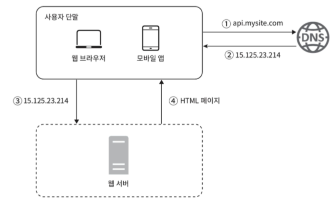
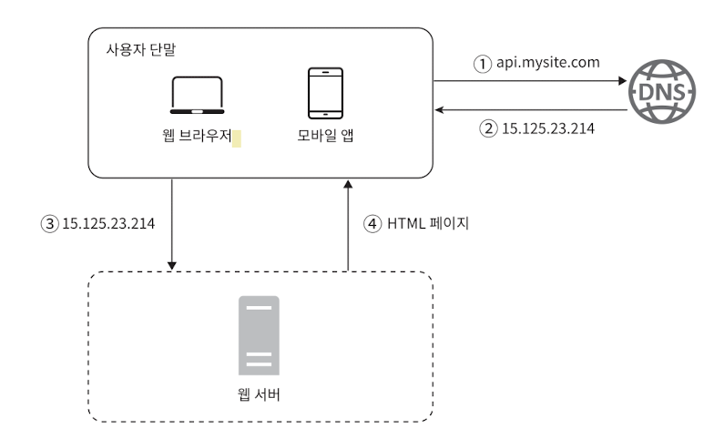
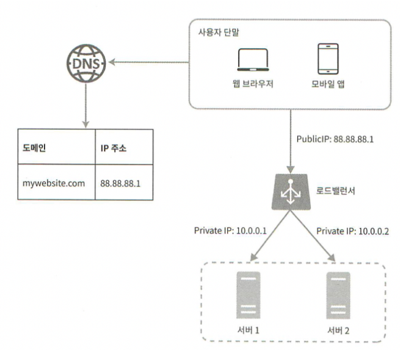
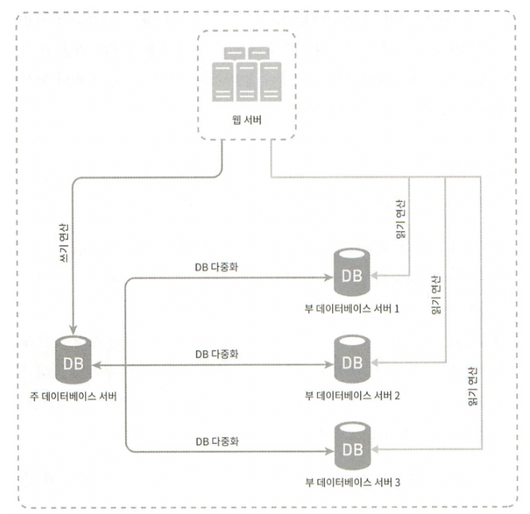
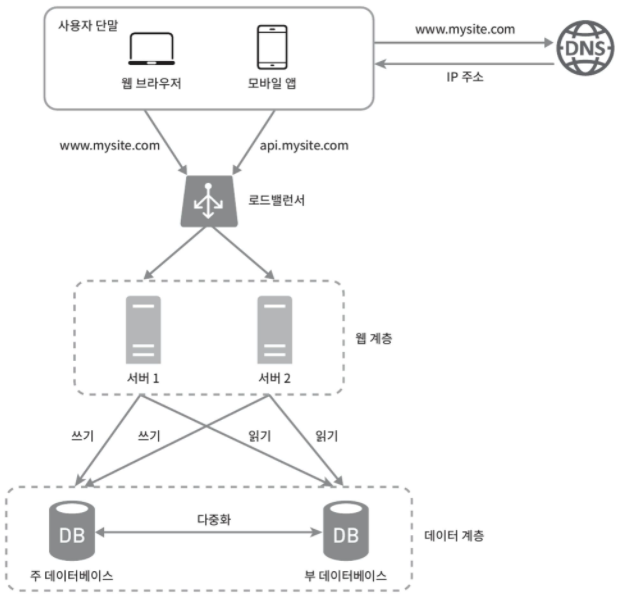
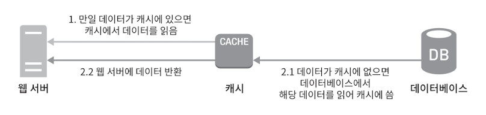

# 1. 사용자 수에 따른 규모 확장성
한 명의 사용자를 지원하는 시스템에서 시작하여, 최종적으로 몇백만 사용자를 지원하는 시스템을 설계해 볼 것이다.

### 1.1. 단일 서버
복잡한 시스템을 만드는 것도 단 한대에서 실행되는 간단한 시스템부터 시작된다.  
먼저 웹 앱, DB, 캐시 등이 한 대의 서버에서 실행되는 구성을 보자.

  
1. 사용자는 도메인을 이용해 웹 사이트에 접속한다.
2. 접속을 위해서는 IP 주소를 알아야하는데 DNS에 질의하여 IP 주소를 변환한다.
3. IP 주소로 HTTP 요청이 전달된다.
4. 요청에 따른 HTML 페이지나 JSON 형태의 응답을 반환한다.

웹 또는 모바일 앱에서 웹 서버로 요청이 온다.

### 1.2. 데이터베이스
사용자가 늘면 서버 하나로는 충분하지 않아 여러 서버를 두어야한다.  
하나는 웹/모바일 트래픽 처리 용도고, 다른 하나는 데이터베이스용이다.  

DB에는 관계형 DB와 비관계형 DB가 있다.  
관계형 DB(RDBMS)에는 MySQL, 오라클, PostgreSQL 등이 있다.  
비관계형 DB(NoSQL)에는 Amazon Dynamo DB, Mongo DB 등이 있다.  

NoSQL은 다시 네 부류로 나눌 수 있다. 
- key-value
- graph
- column
- document

대부분의 개발자에게는 RDBMS가 최선일텐데 40년 이상 시장에서 살아남아 잘 사용되어온 시스템이라서다.  
하지만 다음과 같은 경우는 NoSQL이 바람직한 선택일 수 있다.
- 아주 낮은 응답 지연시간이 요구됨
- 다루는 데이터가 비정형이라 관계형 데이터가 아님
- 데이터(JSON, YAML, XML 등)를 직렬화 하거나 역직렬화 할 수 있기만 하면됨
- 아주 많은 양의 데이터를 저장할 필요가 있음

### 1.3. 수직적 규모 확장 vs 수평적 규모 확장
수직적 규모 확장(Scale-Up)
- 스케일 업에는 한계가 있다. 한 대의 서버에 CPU나 메모리를 무한대로 증설할 방법은 없다.
- 장애에 대한 자동복구 방안이나 다중화 방안을 제시하지 않는다. 서버에 장애가 발생하면 웹/앱은 완전히 중단된다.

이러한 단점 때문에 애플리케이션을 지원하는 데는 수평적 규모 확장법(Scale-Out)이 적절하다.  
앞서 본 설계에서 사용자는 웹 서버에 바로 연결된다. 웹 서버가 다운되면 사용자는 웹 사이트에 접속할 수 없다.  
또한 너무 많은 사용자가 접속하여 웹 서버가 한계 상황에 도달하게 되면 응답 속도가 느려지거나 서버 접속이 불가능해질 수도 있다.  
이런 문제를 해결하는 데는 부하 분산기 또는 로드밸런서를 도입하는 것이 최선이다.

로드밸런서  
  
- 로드밸런서는 트래픽 부하를 고르게 분산하는 역할을 한다.
- 웹 서버는 클라이언트의 접속을 직접 처리하지 않는다.
- 보안을 위해 서버간 통신에는 private IP 주소가 이용된다.
- 서버1이 다운되면 모든 트래픽은 서버2로 전송된다. 따라서 웹 사이트 전체가 다운되는 일이 방지된다.
- 트래픽이 증가하면 더 많은 서버를 추가하기만 하면 된다.

DB 다중화  

- 많은 DB 관리 시스템이 다중화를 지원한다. 주(master)-부(slave) 관계를 설정하고 원본은 주 서버에, 사본은 부 서버에 저장한다.
- 쓰기 연산은 주 서버에서만 지원하고, 부 서버는 사본을 전달받아 읽기연산만을 지원한다. 읽기 연산이 쓰기 연산보다 비중이 훨씬 높기 때문이다.
- 위와 같이 구성하면 병렬로 처리되어 성능도 좋아지고 일부 서버가 파괴되어도 데이터는 보존되어 안전하고, 다른 서버를 사용할 수 있어 가용성이 높아진다.
- 부 서버가 한 대 뿐인데 다운된다면 읽기 연산은 주 서버로 전달된다. 부 서버가 여러대인 경우는 나머지 부 서버들로 분산 될 것이다.
- 주 서버가 다운된다면 한 대의 부 서버가 있는 경우는 해당 서버가 주 서버가 될 것이고, 여러 부 서버가 있다면 하나의 부 서버가 주 서버로 될 것이다.

- 사용자는 DNS로부터 로드밸런서의 public IP 주소를 받는다.
- 사용자는 해당 IP 주소를 사용해 로드밸런서에 접속한다.
- HTTP 요청은 서버1 또는 서버2로 전달된다.
- 웹 서버는 사용자의 데이터를 부 DB 서버에서 읽는다.
- 웹 서버는 데이터 변경 연산은 주 DB 서버로 전달한다.

### 1.4. 캐시
캐시 계층은 데이터가 잠시 보관되는 곳으로 DB보다 훨씬 빠르다.   
캐시 계층을 두면 성능이 개선될 뿐 아니라 DB의 부하도 줄일 수 있고, 캐시 계층의 규모를 독립적으로 확장시키는 것도 가능해진다.  
  
캐시에 있으면 해당 데이터를 반환하고 없으면 데이터를 DB에서 불러와 캐시에 저장한 후 반환한다.

캐시 사용시 유의할 점
- 데이터 갱신은 자주 일어나지 않지만 참조는 빈번하게 일어난다면 고려해볼 만하다.
- 캐시는 휘발성 메모리에 두므로 영속적으로 보관할 데이터를 캐시에 두는것은 바람직하지 않다.
- 캐시 만료에 대한 정책을 마련해야한다. 너무 짧으면 DB에 자주 접근하고, 너무 길면 원본 데이터와 차이날 수 있다.
- 원본 갱신과 캐시 갱신의 연산이 단일 트랜잭션으로 일어나지 않는다면 일관성은 깨질 수 있다.
- 캐시 서버를 한 대만 두는 경우 해당 서버는 단일 장애 지점(SPOF)이 되어버릴 가능성이 있다. 단일 장애 지점이란 특정 지점의 장애가 전체 시스템의 장애로 이어질 수 있는 지점이다. 여러 지역에 걸쳐 서버를 분산시켜야한다.
- 캐시 메모리를 과할당 하면 캐시에 보관될 데이터가 갑자기 늘어났을 때 생길 문제를 방지할 수 있다.
- 캐시가 꽉 차버리면 기존 데이터를 내 보내야할 때 정책을 정해야한다. LRU, LFU, FIFO 등의 알고리즘이 있다.

### 1.5. 콘텐츠 전송 네트워크 (CDN)
CDN
### 1.6. 무상태(stateless) 웹 계층
### 1.7. 데이터 센터
### 1.8. 메시지 큐
### 1.9. 로그, 메트릭 그리고 자동화
### 1.10. 데이터베이스의 규모 확장
### 1.11. 백만 사용자, 그리고 그 이상
