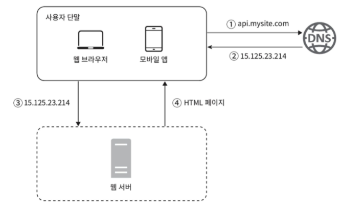

# 1장. 사용자 수에 따른 규모 확장성
한 명의 사용자를 지원하는 시스템에서 시작하여, 최종적으로 몇백만 사용자를 지원하는 시스템을 설계해 볼 것이다.

### 단일 서버
복잡한 시스템을 만드는 것도 단 한대에서 실행되는 간단한 시스템부터 시작된다.  
먼저 웹 앱, DB, 캐시 등이 한 대의 서버에서 실행되는 구성을 보자.

  
1. 사용자는 도메인을 이용해 웹 사이트에 접속한다.
2. 접속을 위해서는 IP 주소를 알아야하는데 DNS에 질의하여 IP 주소를 변환한다.
3. IP 주소로 HTTP 요청이 전달된다.
4. 요청에 따른 HTML 페이지나 JSON 형태의 응답을 반환한다.

웹 또는 모바일 앱에서 웹 서버로 요청이 온다.

### 데이터베이스
### 수직적 규모 확장 vs 수평적 규모 확장
### 캐시
### 콘텐츠 전송 네트워크 (CDN)
### 무상태(stateless) 웹 계층
### 데이터 센터
### 메시지 큐
### 로그, 메트릭 그리고 자동화
### 데이터베이스의 규모 확장
### 백만 사용자, 그리고 그 이상
