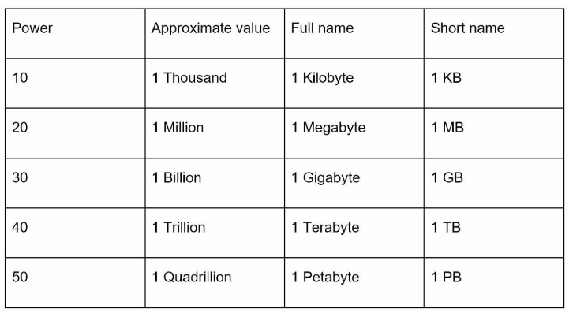
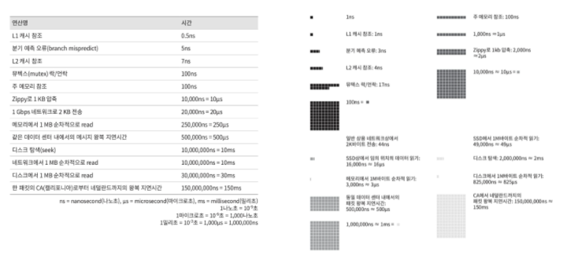

# 2. 개략적인 규모 추정
시스템 설계 면접을 볼 때 시스템 용량이나 성능 요구사항을 개략적으로 추정해보라는 요구를 받게 된다.  
개략적 규모 추정을 효과적으로 해 내려면 규모 확장성을 표현하는 데 필요한 기본기에 능숙해야한다.
특히 2의 제곱수나 응답지연값, 그리고 고 가용성에 관계된 수치들을 기본적으로 잘 이해하고 있어야한다.

### 2.1. 2의 제곱수
분산 시스템에서 다루는 데이터 양은 엄청나게 커질 수 있으나 그 계산법은 기본을 크게 벗어나지 않는다.  
제대로 된 계산 결과를 얻으려면 데이터 볼륨의 단위를 2의 제곱수로 표현하면 어떻게 되는지를 우선 알아야 한다.  
최소 단위는 1바이트이고, 8비트로 구성된다.  
아스키 문자 하나가 차지하는 메모리 크기가 1바이트이다.  

### 2.2. 모든 프로그래머가 알아야 하는 응답지연 값

- 메모리는 빠르지만 디스크는 아직도 느리다.
- 디스크 탐색은 가능한 한 피하라.
- 단순한 압축 알고리즘은 빠르다.
- 데이터를 인터넷으로 전송하기 전에 가능하면 압축하라.
- 데이터 센터는 보통 여러 지역에 분산되어 있고, 센터들 간에 데이터를 주고받는 데는 시간이 걸린다.

### 2.3. 가용성에 관계된 수치들
### 2.4. 예제: 트위터 QPS와 저장소 요구량 추정
### 2.5. 팁
