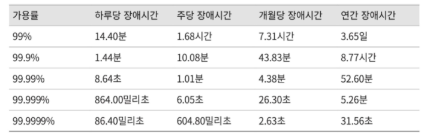

# 2. 개략적인 규모 추정

시스템 설계 면접을 볼 때 시스템 용량이나 성능 요구사항을 개략적으로 추정해보라는 요구를 받게 된다.  
개략적 규모 추정을 효과적으로 해 내려면 규모 확장성을 표현하는 데 필요한 기본기에 능숙해야한다.
특히 2의 제곱수나 응답지연값, 그리고 고가용성에 관계된 수치들을 기본적으로 잘 이해하고 있어야한다.

### 2.1. 2의 제곱수

분산 시스템에서 다루는 데이터 양은 엄청나게 커질 수 있으나 그 계산법은 기본을 크게 벗어나지 않는다.  
제대로 된 계산 결과를 얻으려면 데이터 볼륨의 단위를 2의 제곱수로 표현하면 어떻게 되는지를 우선 알아야 한다.  
최소 단위는 1바이트이고, 8비트로 구성된다.  
아스키 문자 하나가 차지하는 메모리 크기가 1바이트이다.  

### 2.2. 모든 프로그래머가 알아야 하는 응답지연 값

- 메모리는 빠르지만 디스크는 아직도 느리다.
- 디스크 탐색은 가능한 한 피하라.
- 단순한 압축 알고리즘은 빠르다.
- 데이터를 인터넷으로 전송하기 전에 가능하면 압축하라.
- 데이터 센터는 보통 여러 지역에 분산되어 있고, 센터들 간에 데이터를 주고받는 데는 시간이 걸린다.

### 2.3. 가용성에 관계된 수치들

고가용성은 시스템이 오랜 시간 동안 지속적으로 중단 없이 운영될 수 있는 능력을 지칭하는 용어다.  
고가용성을 표현하는 값은 퍼센트로 표현하는데, 100%는 시스템이 단 한번도 중단된 적이 없었음을 의미한다.  
대부분의 서비스는 99%에서 100% 사이의 값을 갖는다.

SLA(Service Level Agreement)는 서비스 사업자와 고객 사이에 맺어진 합의를 의미한다.  
사업자가 제공하는 서비스 가용시간이 공식적으로 기술되어 있는데 아마존, 구글, MS같은 사업자는 99% 이상의 SLA를 제공한다.

### 2.4. 예제: 트위터 QPS와 저장소 요구량 추정
가정
- 월간 능동 사용자(monthly active user)는 3억 명이다.
- 50%의 사용자가 트위터를 매일 사용한다.
- 평균적으로 각 사용자는 매일 2건의 트윗을 올린다.
- 미디어를 포함하는 트윗은 10% 정도다.
- 데이터는 5년간 보관된다.

추정  
QPS(Query Per Second) 추정치
- 일간 능동사용자 (DAU) = 3억 x 50% = 1.5억
- QPS = 1.5억 x 2트윗 / 24시간 / 3600초 = 3500
- 최대 QPS = 2 x QPS = 약 7000

미디어 저장을 위한 저장소 요구량  
- 평균 트윗 크기
  - tweet_id에 64바이트
  - 텍스트에 140 바이트
  - 미디어에 1MB
- 미디어 저장소 요구량 = 1.5억 x 2 x 10% x 1MB = 30TB/day
- 5년간 미디어를 보관하기 위한 저장소 요구량 = 30TB x 365 x 5 = 55PB

### 2.5. 팁
