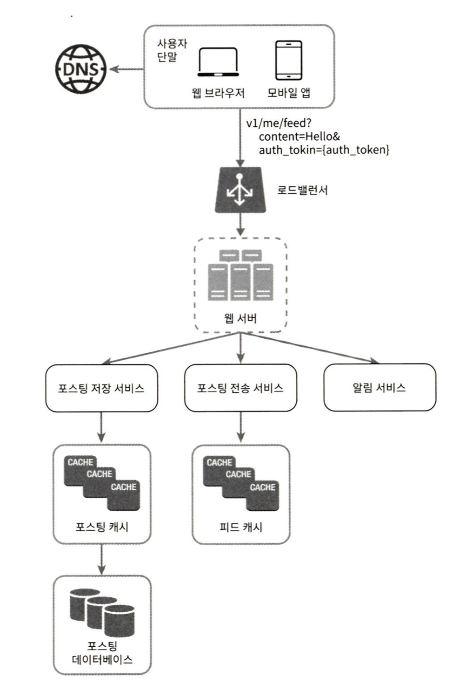
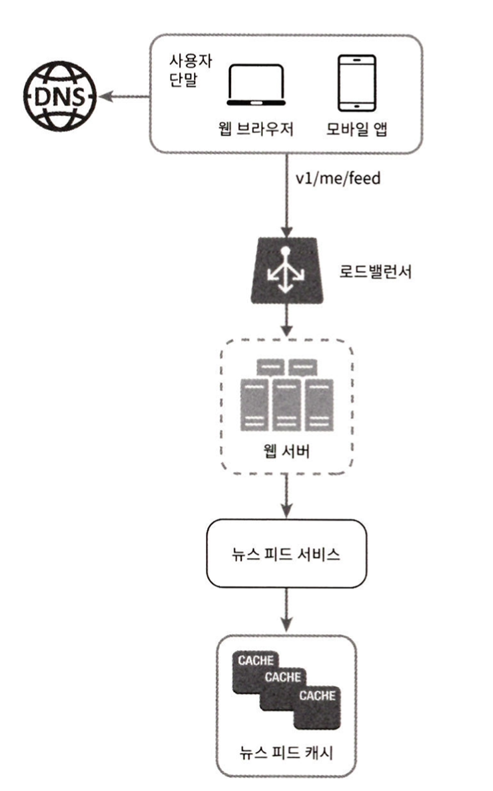

# 3. 시스템 설계 면접 공략법
시스템 설계 면접은 왜 볼까?  
수백 수천명의 엔지니어들이 수년간 개발한 제품을 단 한시간 안에 설계하기를 기대하진 않는다.
모호한 문제를 풀기 위해 해결책을 찾아내는 과정에 대한 시뮬레이션을 보기 위함이다.  

### 3.1. 효과적 면접을 위한 4단계 접근법
#### 1단계 : 문제 이해 및 설계 범위 확정
- 퀴즈쇼가 아니다. 정답은 없다. 그러니 답부터 들이밀지 말아라.
- 적절한 가정을 하고, 올바른 질문을 하고 시스템 구축에 필요한 정보를 모아야한다.
- 구체적으로 어떤 기능을 만들어야하는지?
- 제품 사용자 수는 얼마나 되는지?
- 회사의 규모는 얼마나 빨리 커지리라 예상하는지?
- 회사가 주로 사용하는 기술 스택은 어떤 것들이 있는지?

예제 : 뉴스 피드 시스템을 설계하세요.
- A : 앱과 웹 가운데 어느쪽을 지원해야 하나요?
- B : 둘 다 지원해야 합니다.
- A : 가장 중요한 기능은 무엇인가요?
- B : 새로운 포스트를 올리고, 다른 친구의 뉴스 피드를 볼 수 있도록 하는 기능입니다.
- A : 특별한 정렬 기준이 있나요? 포스트마다 다른 가중치가 부여되어야 하는지 알고싶어서입니다.
- B : 단순화를 위해 시간 역순으로 정렬 된다고 가정할게요.
- A : 한 사용자는 최대 몇 명의 사용자와 친구를 맺을 수 있나요?
- B : 5000명 입니다.
- A : 트래픽 규모는 어느정도인가요?
- B : DAU는 1000만명 입니다.
- A : 이미지나 비디오도 올릴 수 있나요?
- B : 네.

요구사항을 이해하고 모호함을 없애는것이 이 단계에서 가장 중요하다. 

#### 2단계 : 계략적인 설계안 제시 및 동의 구하기
- 설계안에 대한 최초 청사진을 제시하고 의견을 구하라. 면접관을 마치 팀원인 것처럼 대하라. 훌륭한 면접관들은 지원자들과 대화하고 설계 과정에 개입하기를 즐긴다.
- 화이트보드나 종이에 핵심 컴포넌트를 포함하는 다이어그램을 그려라. 클라이언트, api, 웹 서버, 데이터 저장소, 캐시, cdn, 메시지 큐 같은 것들이 포함될 수 있을 것이다.
- 이 최초 설계안이 시스템 규모에 관계된 제약사항들을 만족하는지를 개략적으로 계산해 보라. 계산 과정은 소리내어 설명하라.
- DB스키마까지 설계해야 하는지는 질문에 따라 세부적일수도 있고, 필요할 수도 있다. 

예제 : 뉴스 피드 시스템을 설계하라
1. 피드 발행
   - 사용자가 포스트를 올리면 관련된 데이터가 캐시/데이터베이스에 기록되고, 해당 사용자의 친구 뉴스피드에 뜨게 한다.  
   
2. 피드 생성
   - 어떤 사용자의 뉴스 피드는 해당 사용자 친구들의 포스트를 시간  역순으로 정렬하여 만든다.  
   

#### 3단계 : 상세 설계
- 시스템에서 전반적으로 달성해야 할 목표와 기능 범위 확인
- 전체 설계의 개략적 청사진 마련
- 해당 청사진에 대한 면접관의 의견 청취
- 상세 설계에서 집중해야 할 영역들 확인

#### 4단계 : 마무리
마지막 단계에서 설계 결과물에 관련된 몇 가지 후속 질문을 던질 수 있고, 스스로 추가 논의를 진행하도록 할 수도 있다.  
- 병목구간, 혹은 좀 더 개선 가능한 지점을 찾아내라 주문할 수 있다. 개선할 점은 언제나 있게 마련이다. 비판적 사고 능력을 보이고 좋은 인상을 남길 기회이다.
- 만든 설계를 요약 해주는 것도 도움이 될 수 있다. 
- 오류가 발생하면 무슨 일이 생기는지 따져 보면 흥미로울 것이다.
- 운영 이슈도 논의할 가치가 있다. 메트릭은 어떻게 수집하고 모니터링 할 것인가? 로그는? 배포방식은?
- 미래에 닥칠 규모 확장 요구에 어떻게 대처할 것인지도 흥미로운 주제이다.

해야할 것
- 질문을 통해 확인하라. 스스로 내린 가정이 옳다 믿고 진행하지 마라.
- 문제의 요구사항을 이해하라.
- 정답이나 최선의 답은 없다. 스타트업을 위한 설계와 수백만 사용자를 지원해야하는 서비스의 설계가 같을 리 없다.
- 면접관이 여러분의 사고 흐름을 이해할 수 있도록 해라.
- 가능하면 여러 해법을 제시하라.
- 개략적 설계에 면접관이 동의하면 가장 중요한 컴포넌트 부터 설명하라.
- 면접관의 아이디어를 이끌어 내라. 팀원처럼
- 포기하지 마라.

하지 말아야 할 것
- 전형적인 면접 문제들에도 대비하지 않은 상태에서 면접장에 가지 마라.
- 요구사항이나 가정들을 분명히 하지 않은 상태에서 설계를 제시하지 마라.
- 처음부터 특정 컴포넌트의 세부사항을 너무 깊이 설명하지 마라. 개략적 설계를 마친 뒤에 세부사항으로 이어가라.
- 진행중에 막혔다면 힌트 요청을 주저하지 마라.
- 침묵속에서 진행하지 마라.
- 면접관이 끝났다고 말하기 전까지는 끝난것이 아니다.

시간 배분
- 문제 이해 및 설계 범위 확정 : 3~10분
- 개략적 설계안 제시 및 동의 구하기 : 10~15분
- 상세 설계 : 10~25분
- 마무리 : 3~5분

