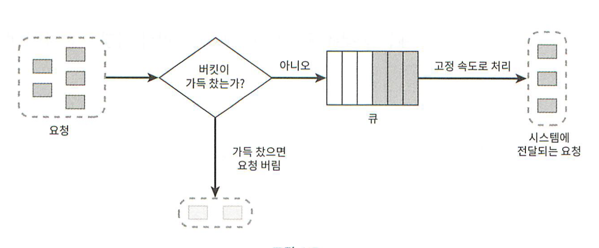

# 4. 처리율 제한 장치의 설계
네트워크 시스템에서 처리율 제한 장치는 클라이언트 또는 서비스가 보내는 트래픽의 처리율을 제어하기 위한 장치다.  
HTTP를 예로 들면 이 장치는 특정 기간 내에 전송되는 클라이언트의 요청 횟수를 제한한다.  
다음은 몇 가지 사례이다.
- 사용자는 초당 2회 이상 새 글을 올릴 수 없다.
- 같은 IP 주소로는 하루에 10개 이상의 계정을 생성할 수 없다.
- 같은 디바이스로는 주당 5회 이상 리워드를 요청할 수 없다.

API에 처리율 제한장치를 두면 좋은 점을 살펴보자.
- DoS 공격에 의한 자원 고갈을 방지할 수 있다. 처리율 제한 장치는 추가 요청에 대해서는 처리를 중단함으로써 DoS 공격을 방지한다.
- 비용을 절감한다. 추가 요청에 대한 처리를 제한하면 서버를 많이 두지 않아도 되고, 우선순위가 높은 API에 더 많은 자원을 할당할 수 있다. 또한 API에 사용료를 지불하는 경우 그 횟수를 제한할 수 있어야 비용을 절감할 수 있을것이다.
- 서버 과부하를 막는다. 봇에서 오는 트래픽이나 사용자의 잘못된 이용 패턴으로 유발된 트래픽을 걸러내는데 처리율 제한 장치를 활용할 수 있다.

### 1단계 : 문제 이해 및 설계 범위 확정
A : 클라이언트 측 제한 장치입니까? 서버 측 제한 장치 입니까? 
B : 서버측 API를 위한 장치를 설계한다고 하죠.
A : 어떤 기준을 사용해서 API호출을 제어해야 할까요? IP주소를 사용해야하나요? 아니면 사용자 ID? 아니면 생각하는 다른 기준이 있나요?
B : 다양한 형태의 제어 규칙을 정의할 수 있도록 하는 유연한 시스템이어야합니다.
A : 규모는 어느정도인가요?
B : 대규모 요청을 처리할 수 있어야합니다.
A : 분산 환경에서도 동작해야하나요?
B : 네.
A : 독립된 서비스입니까? 아니면 애플리케이션 코드에 포함될 수 있습니까?
B : 그 결정은 본인이 내려 주시면 되겠습니다.
A : 처리율 제한 장치에 의해 걸러진 경우 사용자에게 알려야하나요?
B : 네.

요구사항 요약
- 설정된 처리율을 초과하는 요청은 정확하게 제한한다.
- 응답 시간에 나쁜 영향을 주면 안된다.
- 가능한 적은 메모리를 사용해야한다.
- 분산형 처리율 제한 : 하나의 처리율 제한 장치를 여러 서버나 프로세스에서 공유할 수 있어야한다.
- 예외 처리 : 요청이 제한되었을 때는 그 사실을 사용자에게 알려줘야한다.
- 높은 결함 감내성 : 제한 장치에 장애가 생기더라도 전체 시스템에 영향을 주어서는 안된다.

### 2단계 : 계략적인 설계안 제시 및 동의 구하기
처리율 제한 장치는 어디에 둘 것인가?
- 클라이언트 요청은 쉽게 위변조가 가능해 처리율을 안정적으로 걸 수 있는 장소가 못된다.
- 서버에 둘 수도 있고, 미들웨어를 만들어 API 서버 앞에 위치시킬 수도 있다.
- 정답은 없다. 회사의 현재 기술 스택이나 엔지니어링 인력, 우선순위에 따라 달라질 수 있다.
- MSA에 기반하고 있고 사용자 인증이나 IP허용 목록 관리 등을 처리하기 위해 API 게이트웨이를 이미 설계에 포함시켰다면 처리율 제한 기능 또한 게이트웨이에 포함시켜야 할 수도 있다.
- 직접 만드는데는 시간이 든다. 충분한 인력이 없다면 상용 API 게이트웨이를 쓰는것이 바람직하다.

처리율 제한 알고리즘
- 토큰 버킷  
  
  - 여러 기업들이 보편적으로 이용하고 있다.
  - 일정한 양의 토큰이 버킷에 주기적으로 공급된다.
  - 버킷은 최대 용량을 가지고 있다.
  - 각 요청당 하나의 토큰이 사용된다.
  - 토큰이 없으면 요청은 버려진다.
  - 인자 : 버킷 크기, 토큰 공급률(초당 공급 개수)
  - 사용자마다 포스팅제한, 친구 추가 제한, 좋아요 제한이 있다면 버킷은 3개 필요하다.
  - IP주소별 제한이 있다면 IP 주소마다 버킷이 1개 필요하다.
  - 시스템 처리율을 초당 1만개 요청으로 제한한다면 모든 요청이 하나의 버킷을 공유해야한다.
  - 장점 : 구현이 쉽다. 메모리 사용이 효율적이다. 짧은 시간에 집중되는 트래픽도 처리 가능하다.
  - 단점 : 버킷 크기와 토큰 공급률을 적절히 튜닝하는것이 까다롭다. 버려지는 요청이 있다.
- 누출 버킷  
  
  - 전자 상거래 기업인 쇼피파이가 이 알고리즘을 사용한다.
  - 토큰 버킷과 비슷하지만 요청 처리율이 고정되어있다.
  - FIFO로 동작한다.
  - 큐에 빈 자리가 있으면 큐에 요청을 넣는다.
  - 큐가 가득 차면 요청은 버린다.
  - 지정된 시간마다 큐에서 요청을 꺼내어 처리한다.
  - 인자 : 버킷 크기(큐 사이즈), 처리율
  - 장점 : 큐의 크기가 제한되어 있어 메모리 측면에서 효율적이다. 고정된 처리율을 갖고 있기 때문에 안정적인 출력이 필요한 경우에 적합하다.
  - 단점 : 단시간에 많은 트래픽이 몰리면 버려지는 요청이 많다. 2개의 인자를 튜닝하기 까다롭다.
- 고정 윈도 카운터  
  
  - 타임라인을 고정된 윈도로 나누고 각 윈도마다 카운터를 붙인다.
  - 요청이 접수될 때 마다 카운터 값은 1씩 증가한다.
  - 카운터의 값이 임계치에 도달하면 새로운 요청은 새 윈도가 열릴 때까지 버려진다.
  - 문제점 : 윈도 경계 부근에 순간적으로 많은 트래픽이 몰리면 윈도에 할당된 양보다 많은 요청이 처리될 수 있다.
  - 장점 : 메모리 효율이 좋다. 이해하기 쉽다. 윈도가 닫히는 시점에 카운터를 초기화하는 방식은 특정한 트래픽 패턴을 처리하기에 적합하다.
  - 단점 : 윈도 경계 부근에서 일시적으로 많은 트래픽이 몰리는 경우 기대했던 시스템의 처리 한도보다 많은 양의 요청을 처리하게 된다.
- 이동 윈도 로그  
  
  - 고정 윈도 카운터의 문제를 해결한다.
  - 요청의 타임스탬프를 추적한다. 타임스탬프 데이터는 보통 레디스의 정렬 집합 같은 캐시에 보관한다.
  - 새 요청이 오면 만료된 타임 스탬프는 제거한다. 만료된 타임 스탬프는 현재 윈도의 시작지점보다 오래된 타임스탬프를 말한다.
  - 새 요청의 타임스탬프를 로그에 추가한다.
  - 로그의 크기가 허용치보다 같거나 작으면 요청을 시스템에 전달한다. 그렇지 않은 경우에는 처리를 거부한다.
  - 3번의 1:00:50 요청은 타임스탬프 로그에 남지만 로그 크기가 3이되어 요청은 거부된다.
  - 4번의 1:01:40 요청으로 [1:00:40, 1:01:40) 이전 요청인 1:00:01과 1:00:30은 로그에서 삭제하고, 로그의 크기는 2가 되어 요청을 처리한다.
  - 장점 : 정교하다.
  - 단점 : 다량의 메모리를 사용한다. 거부된 요청의 타임 스탬프도 보관하기 때문이다.
- 이동 윈도 카운터  
  
  - 고정 윈도 카운터와 이동 윈도 로그를 합친것이다.
  - 현재 1분간의 요청 수 + 직전 1분간의 요청수 x 이동 윈도와 직전 1분이 겹치는 비율
  - 이 공식에 따르면 3+5x70% = 6.5개에서 버림하면 6이다.
  - 분당 7개 요청이라고 했으므로 도착한 신규 요청은 처리될 것이다.
  - 장점 : 이전 시간대의 평균 처리율에 따라 현재 윈도의 상태를 계산하므로 짧은 시간에 몰리는 트래픽에도 잘 대응한다. 메모리 효율이 좋다.
  - 단점 : 직전 시간대에 도착한 요청이 균등하게 분포되어있다고 가정한 상태에서 계산하기 때문에 다소 느슨하다. 하지만 0.003%로 미미하다.

  
처리율 제한 미들웨어는 레디스의 지정 버킷에서 카운터를 가져와서 한도에 도달했는지 아닌지를 검사한다.  
한도에 도달했다면 요청은 거부된다.  
한도에 도달하지 않았다면 요청은 API서버로 전달된다.

### 3단계 : 상세 설계
계략적인 설계에서는 다음과 같은 사항을 알 수 없다.
- 처리율 제한 규칙은 어떻게 만들어지 고 어디에 저장되는가?
- 처리가 제한된 요청들은 어떻게 처리되는가?

#### 처리율 제한 규칙
- 하루 5개로 제한
- 클라이언트 분당 5회 이상 로그인 제한

#### 처리율 한도 초과 트래픽 처리
- X-Ratelimit-Remaining : 윈도 내에 남은 처리 가능 요청의 수
- X-Ratelimit-Limit : 매 윈도마다 클라이언트가 전송할 수 있는 요청의 수
- X-Ratelimit-Retry-After : 한도 제한에 걸리지 않으려면 몇 초 뒤에 요청을 다시 보내야 하는지 알림

  
- 처리율 제한 규칙은 디스크에 보관한다. 작업 프로세스는 수시로 규칙을 디스크에서 읽어 캐시에 저장한다.
- 클라이언트가 요청을 서버에 보내면 요청은 먼저 처리율 제한 미들웨어에 도달한다.
- 처리율 제한 미들웨어는 제한 규칙을 캐시에서 가져오고, 카운터 및 마지막 요청의 타임스탬프를 레디스 캐시에서 가져온다.
- 제한에 걸리지 않으면 API 서버로 보낸다.
- 제한에 걸리면 429 too many request 에러를 보낸다.
- 요청은 버릴 수도 있고, 메시지 큐에 보관할 수도 있다.

#### 분산 환경에서의 처리율 제한 장치의 구현
분산 환경은 두 가지 어려운 문제를 풀어야 한다.
- race condition(경쟁조건)  
  
  - 카운터의 값은 5개 되어야하지만 4가 된다.
  - 가장 널리 알려진 해결책은 락(lock)이다. 하지만 성능을 상당히 떨어뜨린다.
  - 루아스크립트, 정렬집합의 레디스를 사용하면 해결가능하다.
- synchronization(동기화)  
  
  
  - 트래픽이 많아지면 처리율 제한장치도 여러 대를 둬야하는데, 웹 계층은 stateless하므로 동기화 이슈를 해결해야한다.
  - sticky session 방법이 있지만 별로 유연하지 않아 추천하지는 않는다.
  - 결국은 중앙 집중형인 redis를 사용하는 것이다.

#### 성능 최적화
분산된 지역으로 에지서버를 둬 시간을 줄일 수 있다.   
또한 동기화 할 때 최종 일관성 모델을 사용하는 것이다.

#### 모니터링
효과적으로 동작하는지 모니터링이 필요한 데 모니터링을 통해 확인하고자 하는것은 다음 두 가지 이다.
- 채택된 알고리즘이 효과적인가
- 정의한 처리율 제한 규칙이 효과적인가

### 4단계 : 마무리
시간이 된다면 다음과 같은 주제를 다뤄보면 좋다.
- 경성(hard) 또는 연성(soft) 처리율 제한
  - 경성 : 요청의 개수는 임계치를 절대 넘을 수 없다.
  - 연성 : 잠시동안은 임계치를 넘을 수 있다.
- 다양한 계층에서의 처리율 제한
  - 이번 장에서는 7계층에서의 처리율 제한에 대해서만 살펴 보았다.
  - IP table을 이용하면 3계층에 처리율 제한을 적용할 수 있다.
- 처리율 제한을 회피하는 방법. 클라이언트 설계를 어떻게 하는것이 최선인가?
  - 클라이언트 측 캐시를 사용하여 API 호출 횟수를 줄인다.
  - 임계치를 이해하고 짧은 시간동안 너무 많은 메시지를 보내지 않도록 한다.
  - 예외나 에러처리를 하는 코드를 도입하여 예외적 상황으로부터 우아하게 복구될 수 있도록 한다.
  - 재시도 로직을 구현할 때는 충분한 백오프 시간을 둔다.