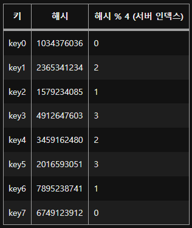
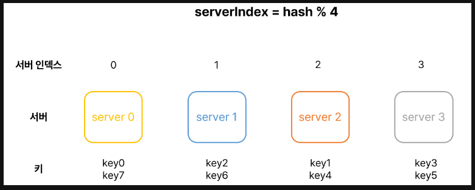
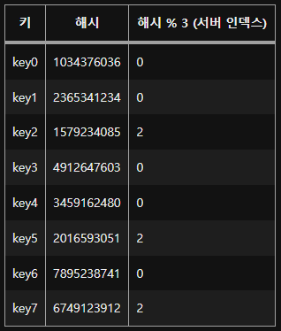
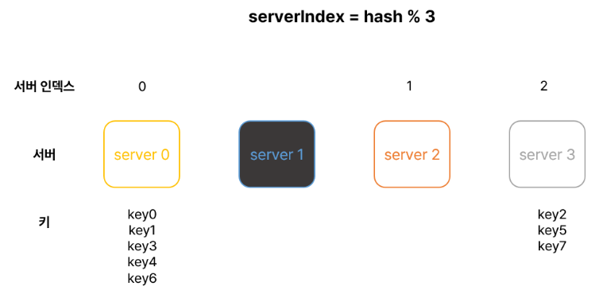
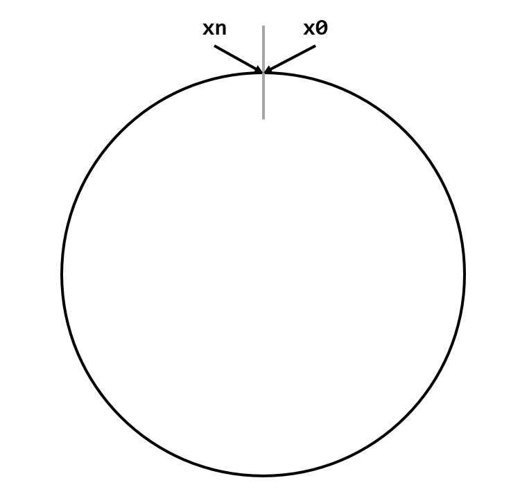

# 5장. 안정 해시 설계
스평적 규모 확장성을 달성하기 위해서는 요청 또는 데이터를 서버에 균등하게 나누는 것이 중요하다.  
안정 해시는 이 목표를 달성하기 위해 보편적으로 사용하는 기술이다.  
우선 이 해시 기술이 풀려고 하는 문제를 살펴 볼 것이다.

### 해시키 재배치(rehash) 문제
N개의 캐시 서버가 있다고 하자. 이 서버들에 부하를 균등하게 나누는 보편적 방법은 아래의 해시 함수를 사용하는 것이다.
```text
serverIndex = hash(key) % N
```

  
  
서버 4대가 있다고 가정하면 `hash % 4`로 요청이 갈 것이다.  
하지만 이 방법은 서버 풀의 크기가 고정되어있을 때 그리고 데이터 분포가 균등할 때는 잘 동작한다. 하지만 서버가 추가되거나 기존서버가 삭제되면 문제가 생긴다.

  
  
만약 서버1이 장애로 동작을 중단했다고 하면 해시 값은 변함이 없지만 모듈러 연산을 적용하여 계산한 서버 인덱스 값은 달라진다.  
그로인해 죽은 서버 뿐만 아니라 기존의 키들도 재분배되어 대규모 캐시 미스가 발생할 수 있다. 

### 안정 해시
안정 해시는 해시테이블 크기가 조정될 때 오직 k/n개의 키만 재배치하는 해시 기술이다.  
k는 키의 개수이고, n은 슬롯의 개수다.  
이와 달리 대부분의 전통적 해시 테이블은 슬롯의 수가 바뀌면 거의 대부분 키를 재배치한다.  

#### 해시 공간과 해시 링
해시의 동작 원리를 알아보자.  
해시 함수 f로는 SHA-2을 사용한다고 하고, 그 함수의 출력 값 범위는 x0, x1, x2, ... , xn과 같다고 하자.  
SHA-1의 해시공간 범위는 0부터 2^160-1까지라고 알려져 있다. 따라서 x0는 0, xn은 2^160-1이며, 나머지 1부터 xn-1까지는 그 사이의 값을 갖게 될 것이다.  
이 해시 공간의 양쪽을 구부리면 해시 링이 만들어 진다.  
  
