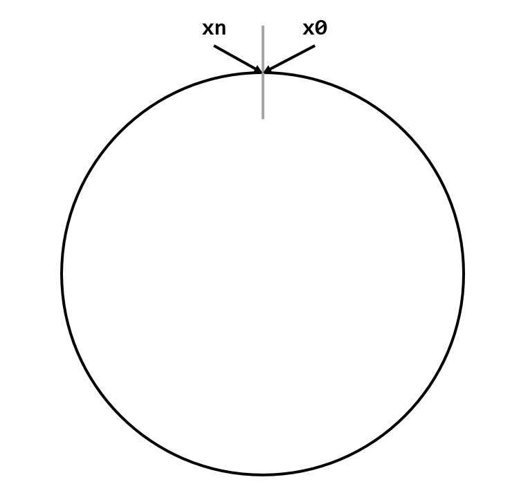
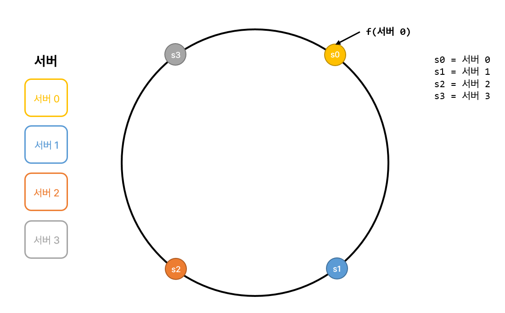
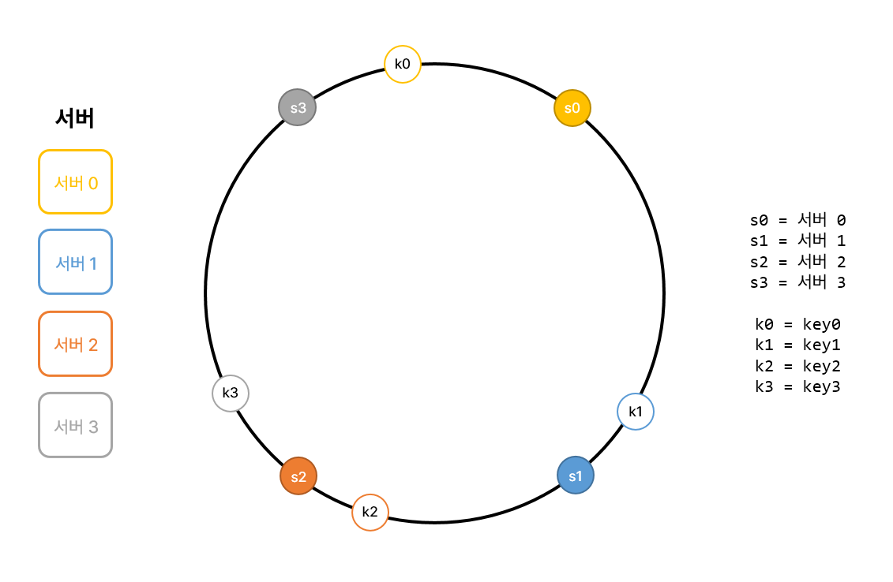
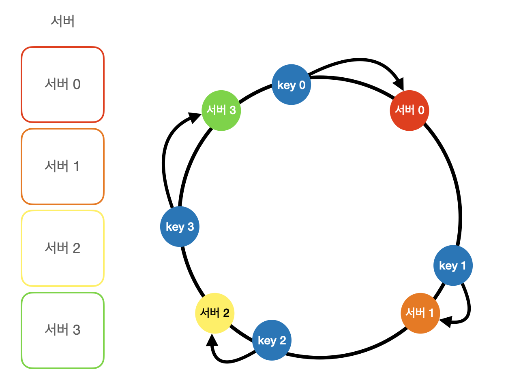
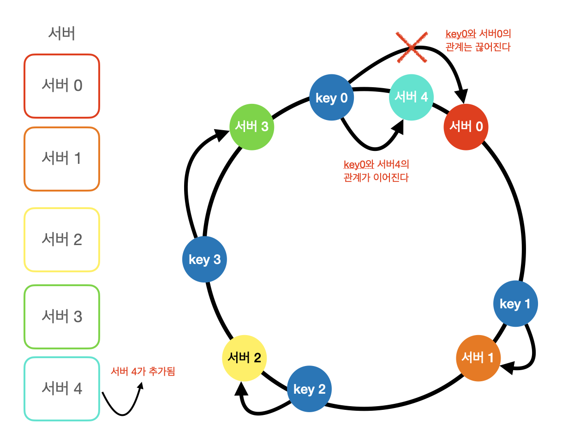
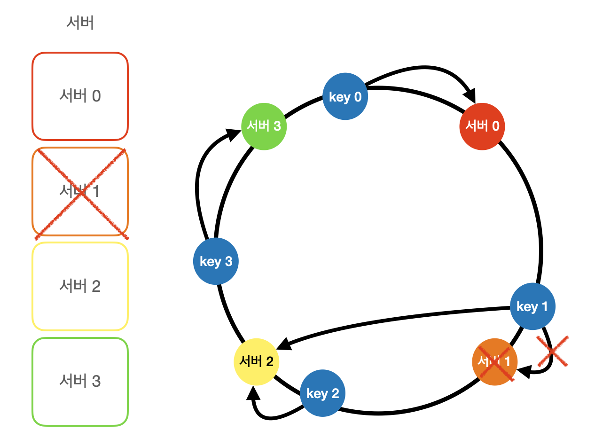
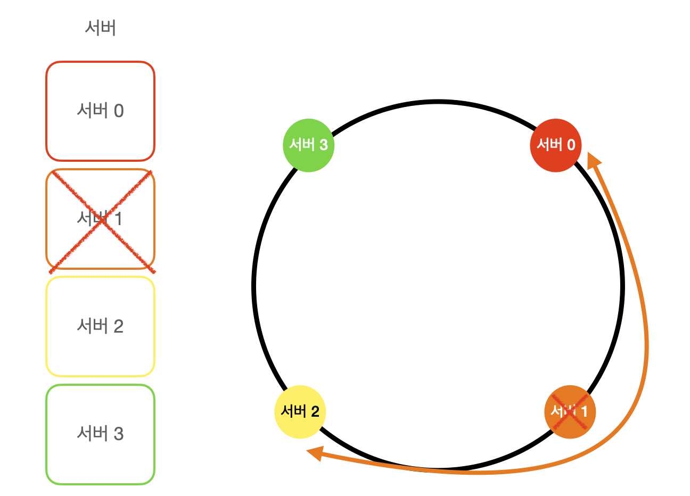
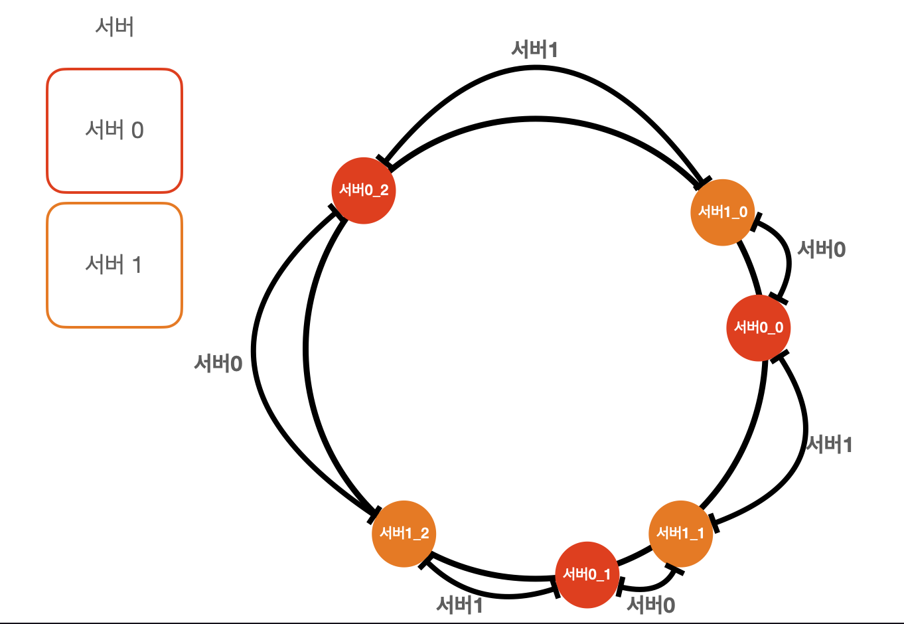
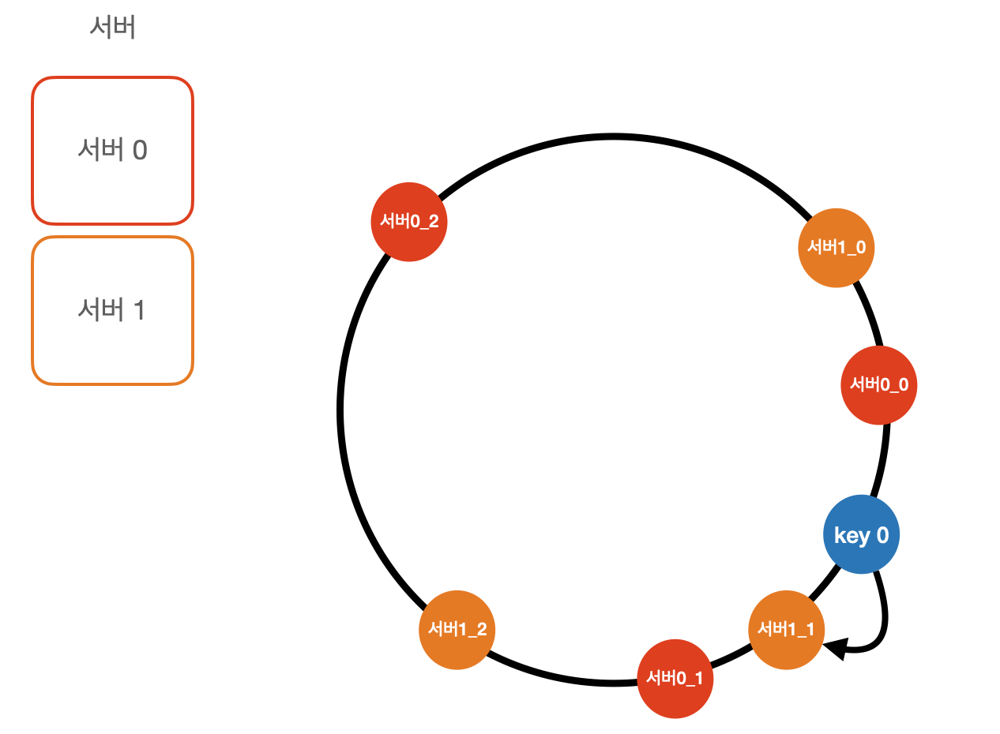

# 5장. 안정 해시 설계
스평적 규모 확장성을 달성하기 위해서는 요청 또는 데이터를 서버에 균등하게 나누는 것이 중요하다.  
안정 해시는 이 목표를 달성하기 위해 보편적으로 사용하는 기술이다.  
우선 이 해시 기술이 풀려고 하는 문제를 살펴 볼 것이다.

### 해시키 재배치(rehash) 문제
N개의 캐시 서버가 있다고 하자. 이 서버들에 부하를 균등하게 나누는 보편적 방법은 아래의 해시 함수를 사용하는 것이다.
```text
serverIndex = hash(key) % N
```

  
  
서버 4대가 있다고 가정하면 `hash % 4`로 요청이 갈 것이다.  
하지만 이 방법은 서버 풀의 크기가 고정되어있을 때 그리고 데이터 분포가 균등할 때는 잘 동작한다. 하지만 서버가 추가되거나 기존서버가 삭제되면 문제가 생긴다.

  
  
만약 서버1이 장애로 동작을 중단했다고 하면 해시 값은 변함이 없지만 모듈러 연산을 적용하여 계산한 서버 인덱스 값은 달라진다.  
그로인해 죽은 서버 뿐만 아니라 기존의 키들도 재분배되어 대규모 캐시 미스가 발생할 수 있다. 

### 안정 해시
안정 해시는 해시테이블 크기가 조정될 때 오직 k/n개의 키만 재배치하는 해시 기술이다.  
k는 키의 개수이고, n은 슬롯의 개수다.  
이와 달리 대부분의 전통적 해시 테이블은 슬롯의 수가 바뀌면 거의 대부분 키를 재배치한다.  

#### 해시 공간과 해시 링
해시의 동작 원리를 알아보자.  
해시 함수 f로는 SHA-2을 사용한다고 하고, 그 함수의 출력 값 범위는 x0, x1, x2, ... , xn과 같다고 하자.  
SHA-1의 해시공간 범위는 0부터 2^160-1까지라고 알려져 있다. 따라서 x0는 0, xn은 2^160-1이며, 나머지 1부터 xn-1까지는 그 사이의 값을 갖게 될 것이다.  
이 해시 공간의 양쪽을 구부리면 해시 링이 만들어 진다.  
  

#### 해시 서버
이 해시 함수 f를 사용하면 서버 IP나 이름을 이 링 위의 어떤 위치에 대응시킬 수 있다.


#### 해시 키
여기 사용된 해시 함수는 "해시 키 재배치 문제"에 언급된 함수와 다르며, 모듈러 연산을 사용하지 않고 있음에 유의하자.  
그림과 같이 캐시할 키 또한 해시 링 위의 어느 지점에 배치할 수 있다.  


#### 서버 조회
어떤 키가 저장되는 서버는, 해당 키의 위치로부터 시계방향으로 링을 탐색해 나가면서 만나는 첫 번째 서버다.


#### 서버 추가
서버를 추가하더라도 일부만 재배치하면 된다.  
서버 4가 추가된 뒤에 key0만 서버4로 재배치하면 된다.  


#### 서버 제거
서버 1을 제거하면 key1만 서버2로 재배치하면된다.  


#### 기본 구현법의 두 가지 문제
안정 해시 알고리즘은 MIT에서 처음 제안되었다. 그 기본 절차는 다음과 같다.
- 서버와 키를 균등 분포 해시 함수를 사용해 해시 링에 배치한다.
- 키의 위치에서 링을 시계방향으로 탐색하다 만나는 최초의 서버가 키가 저장될 서버다.

이 접근법의 문제점은 서버가 추가되거나 삭제되면 파티션의 크기를 균등하게 유지하는 게 불가능 하다는 것이 첫 번째 문제이다.


두 번째 문제는 키의 균등 분포를 달성하기 어렵다는 것이다.  
이 문제를 해결하기 위해 제안된 기법이 가상 노드(virtual node) 또는 복제(replica)라 불리는 기법이다.

#### 가상 노드
가상 노드는 실제 노드 또는 서버를 가리키는 노드로서 하나의 서버는 링 위에 여러개의 가상 노드를 가질 수 있다.  
따라서 서버는 하나가 아닌 여러 개 파티션을 관리해야 한다.


키가 시계방향으로 돌며 최초로 만나는 서버나 가상 노드를 만나면 그 서버 혹은 가상노드가 가리키는 서버에 키값이 저장된다.


가상 노드의 개수를 늘리면 키의 분포는 점점 더 균등해진다.
가상 노드의 개수를 더 늘리면 표준편차의 값은 더 떨어져 데이터가 더 고르게 분포되겠지만 가상 노드를 저장할 공간은 더 많이 필요해 타협점이 필요할 것이다.  

### 마치며
안정 해시의 이점은 다음과 같다.
- 서버가 추가되거나 삭제될 때 재배치 되는 키의 수가 최소화 된다.
- 데이터가 보다 균등하게 분포하게 되므로 수평적 규모 확장성을 달성하기 쉽다.
- 핫스팟 키 문제를 줄인다. 특정한 샤드에 대한 접근이 지나치케 빈번하면 서버 과부하 문제가 생길 수 있다. 유명인의 데이터가 전부 같은 샤드에 몰리는 상황을 생각해보면 이해가 쉬을 것이다. 안정 해시는 데이터를 좀 더 균등하게 분배하므로 이런 문제가 생길 가능성을 줄인다.

안정 해시는 실제로 널리 쓰이는 기술이다.
- 아마존 DynamoDB의 파티셔닝 관련 컴포넌트
- 아파치 카산드라(Apache Cassandra) 클러스터에서의 데이터 파티셔닝
- 디스코드(Discord) 채팅 어플리케이션
- 아카마이(Akamai) CDN
- 매그레프(Meglev) 네트워크 부하 분산기