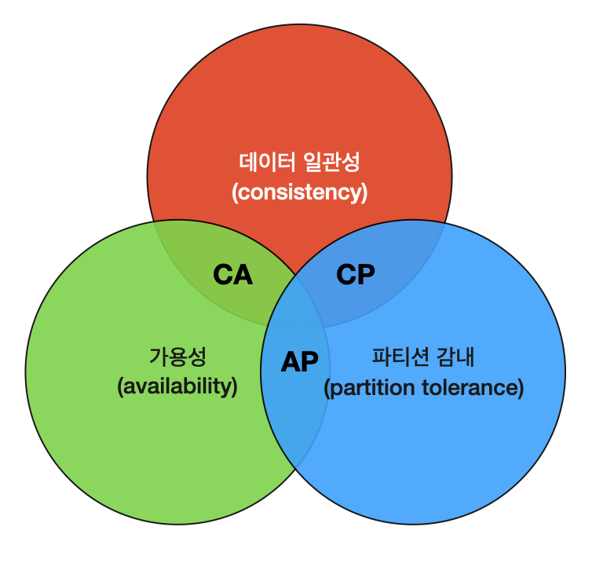
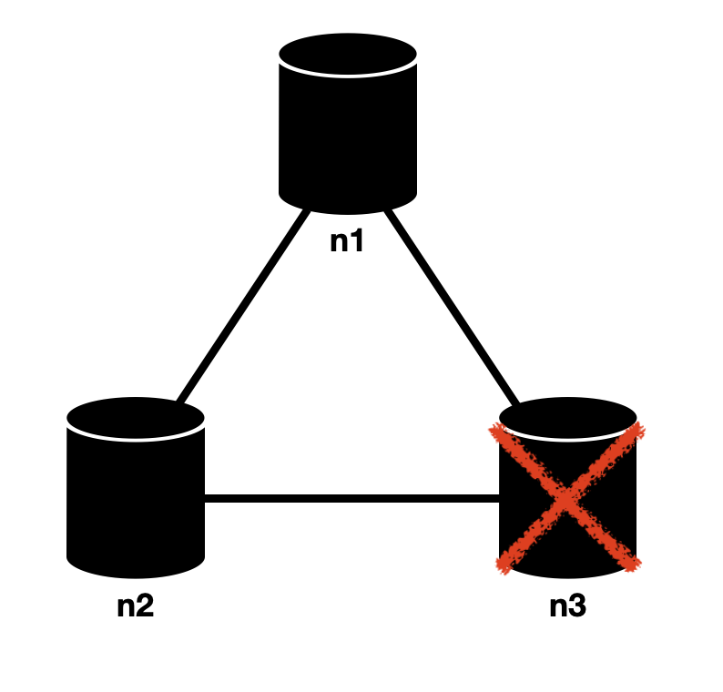
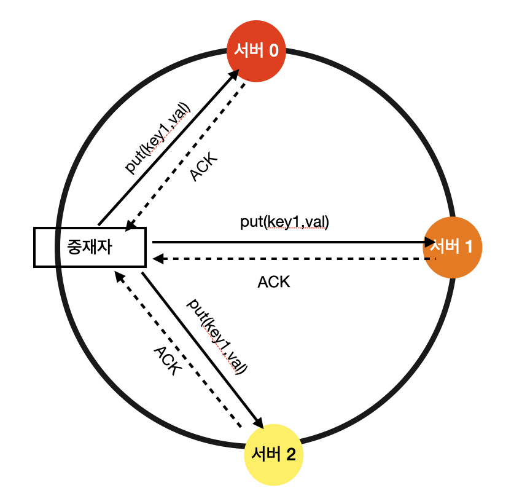
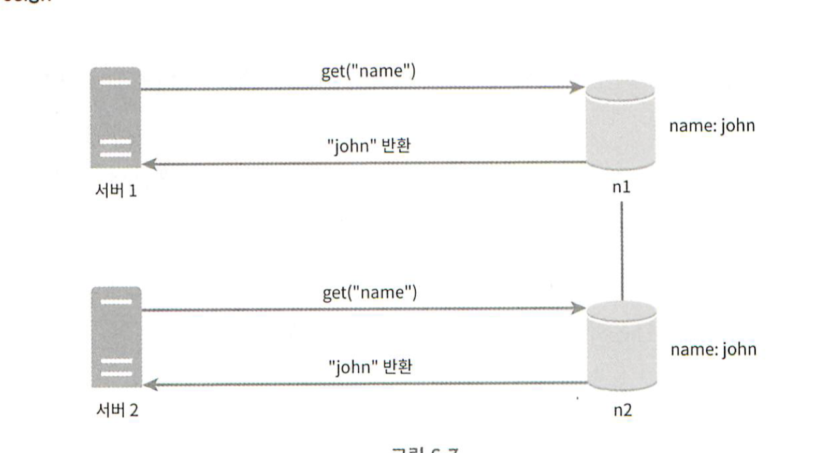
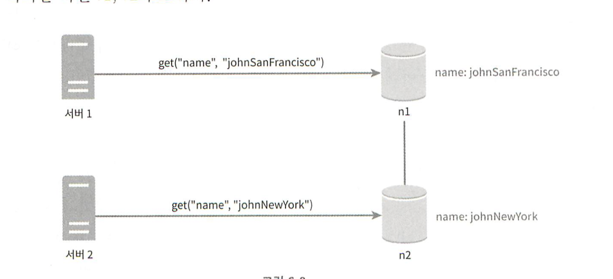
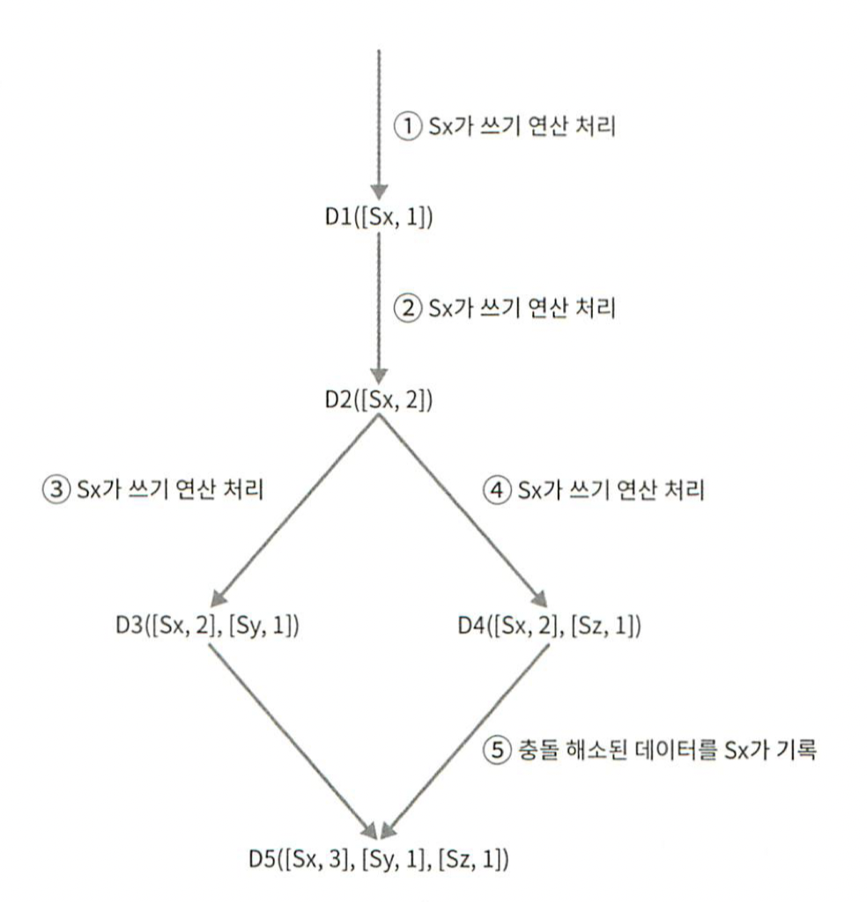

# 6장. 키-값 저장소 설계
키-값 저장소란 키-값 DB라고도 불리는 비 관계형 데이터베이스이다. 이 저장소에 저장되는 값은 고유 식별자를 키로 가져야한다.  
키-값 쌍에서의 키는 유일해야 하며 해당 키에 매달린 값은 키를 통해서만 접근할 수 있다. 키는 일반 텍스트일 수도 있고 해시 값일 수도 있다. 성능상의 이유로 키는 짧을수록 좋다.

키 예시
- 일반 텍스트 키: "last_logged_in_at"
- 해시 키: 253DDEC4

값은 문자열일 수도 있고 리스트일 수도 있고 객체일 수도 있다. 보통은 값으로 무엇이 오든 상관하지 않는다.  
널리 알려진 저장소로는 아마존 다이나모, memcached, redis 같은 것들이 있다.

### 문제 이해 및 설계 범위 확정
완벽한 설계란 없다. 상황에 맞게 적절한 설계를 해나가면 된다.
- 키-값 쌍의 크기는 10KB 이하이다.
- 큰 데이터를 저장할 수 있어야 한다.
- 높은 가용성을 제공해야 한다. 따라서 장애가 있더라도 빨리 응답해야 한다.
- 높은 규모 확장성을 제공해야 한다. 트래픽 양에 따라 자동적으로 서버 증설/삭제가 이뤄져야 한다.
- 데이터 일관성 수준은 조정이 가능해야 한다.
- 지연시간이 짧아야 한다.

### 단일 서버 키-값 저장소
한 대 서버만 사용하는 키-값 저장소를 설계하는 것은 쉽다. 가장 직관적인 방법은 키-값 쌍 전부를 메모리 해시 테이블로 저장하는 것이다.  
이 접근법은 빠른 속도를 보장하지만 모든 데이터를 메모리 안에 보관해야하는것이 불가능할 수도 있다.  
해결책으로는 데이터 압축, 자주 쓰이는 데이터만 메모리에 두고 나머지는 디스크에 저장하는 방식이 있다.  
이렇게 한다고 해도 서버 한 대로 부족한 때가 온다.    
그래서 키-값 저장소를 만들 필요가 있다.

### 분산 키-값 저장소
분산 키-값 저장소는 분산 해시 테이블이라고도 불린다.  
분산 시스템을 설계할 때는 CAP(Consistency Availability, Partition Tolerance theorem)를 이해하고 있어야 한다.

#### CAP 정리
    
CAP 정리는 데이터 일관성, 가용성, 파티션 감내라는 세 가지 요구사항을 동시에 만족하는 분산 시스템을 설계하는 것은 불가능하다는 정리다.
- 데이터 일관성 : 분산 시스템에 접속하는 모든 클리이언트는 어떤 노드에 접속했느냐에 관계 없이 언제나 같은 데이터를 보게 되어야 한다.
- 가용성 : 분산 시스템에 접속하는 클라이언트는 일부 노드에 장애가 발생하더라도 항상 응답받을 수 있어야 한다.
- 파티션 감내 : 파티션은 두 노드 사이에 통신 장애가 발생하였음을 의미한다. 파티션 감내는 네트워크에 파티션이 생기더라도 시스템은 계속 동작하여야 한다는 것을 뜻한다.

CAP 정리는 어떤 두 가지를 충족하려면 나머지 하나는 반드시 희생되어야 한다는 것을 의미한다.

CP 시스템 : 일관성과 파티션 감내를 지원하는 키-값 저장소. 가용성을 희생한다.
AP 시스템 : 가용성과 파티션 감내를 지원하는 키-값 저장소. 일관성을 희생한다.
CA 시스템 : 일관성과 가용성을 지원하는 키-값 저장소. 파티션 감내는 지원하지 않는다. 통상 네트워크 장애는 피할 수 없는 일로 여겨지므로, 분산 시스템은 반드시 파티션 문제를 감내할 수 있도록 설계되어야
한다. 그러므로 실세계에서 CA 시스템은 존재하지 않는다.

#### 실세계의 분산 시스템
  
분산 시스템은 파티션 문제를 피할 수 없다. 그리고 파티션 문제가 발생하면 일관성과 가용성 사이에서 하나를 선택해야한다.  
일관성을 선택한다면 데이터 불일치를 피하기 위해 n1과 n2에 쓰기 연산을 중단시켜야 하는데, 그렇게 하면 가용성이 깨진다. 은행권 시스템은 일관성을 양보하지 않는다.  
가요성을 선택한다면 계속 읽기 연산을 허용해야한다. n1, n2는 쓰기연산을 허용할 것이고 파티션 문제가 해결된 뒤에 n3에 전송할 것이다.

#### 데이터 파티션
대규모 애플리케이션의 경우 전체 데이터를 한 대 서버에 욱여 넣는것은 불가능하다. 가장 단순한 해결책은 데이터를 작은 파티션들로 분할한 다음 여러대 서버에 저장하는 것이다.
- 데이터를 여러 서버에 고르게 분산할 수 있는가?
- 노드가 추가되거나 삭제될 때 데이터의 이동을 최소화 할 수 있는가?

안정 해시 설계는 이 문제를 푸는데 적합한 기술이다.  
안정 해시를 사용하면 규모 확장 자동화할 수 있고, 가상 노드를 만들 수 있다.

#### 데이터 다중화
고가용성과 안정성을 확보하기 위해서는 N개의 서버에 비동기적으로 다중화할 필요가 있다.  
가상 노드를 사용한다면 선택한 N개의 노드가 실제 물리서버 개수가 N보다 작아질 수있다. 같은 물리 서버를 중복 선택하지 않도록 해야한다.  
안정성 담보를 위해서는 다른 데이터 센터의 서버에 보관해야 한다.

#### 데이터 일관성
정족수 합의(Quorum Consensus) 프로토콜을 사용하면 읽기/쓰기 연산 모두에 일관성을 보장할 수 있다.
- N: 사본 개수
- W: 쓰기 연산에 대한 정족수. 쓰기 연산이 성공한 것으로 간주되려면 적어도 W개의 서버로부터 쓰기 연산이 성공했다는 응답을 받아야 한다.
- R: 읽기 연산에 대한 정족수. 읽기 연산이 성공한 것으로 간주되려면 적어도 R개의 서버로부터 쓰기 연산이 성공했다는 응답을 받아야 한다.

  
중재자는 노드 사이에서 proxy 역할을 한다.  
W=1은 데이터가 한 대의 서버에만 기록된다는 뜻이다. 따라서 s1로부터 쓰기 성공 응답을 받았다면 s0, s2의 응답을 기다릴 필요가 없다.  
W=1 또는 R=1인 구성의 경우 중재자는 하나의 서버로만 응답을 받으면 되니 빠를것이다. 하지만 1보다 큰 경우는 가장 느린 서버로부터의 응답을 기다려야하니 느려질것이다.  
W+R > N인 경우는 강한 일관성이 보장된다. 일관성을 보증할 최신 데이터를 가진 노드가 최소 하나는 겹치기 때문이다.

면접시에는 이렇게 정하면 된다.
- R=1, W=N: 빠른 읽기 연산에 최적화된 시스템
- W=1, R=N: 빠른 쓰기 연산에 최적화된 시스템
- W+R > N: 강한 일관성이 보장됨(보통 N=3, W=R=2)
- W+R <= N: 강한 일관성이 보장되지 않음

#### 일관성 모델
- 강한 일관성: 모든 읽기 연산은 최근에 갱신된 결과를 반환한다. 절대로 이전 데이터를 보지 못한다.(쓰기 연산 결과가 반영되기 전까지 데이터 읽기/쓰기 금지, 고가용성에 적합하지 않음.)
- 약한 일관성: 읽기 연산은 가장 최근에 갱신되 ㄴ결과를 반환하지 못할 수 있다.
- 최종 일관성: 약한 일관성의 한 형태로 갱신 결과가 결국에는 모든 사본에 동기화되는 모델이다.(다이나모, 카산드라의 모델임. 데이터 일관성이 깨지는 것은 클라이언트측 버저닝으로 해결한다.)

#### 비일관성 해소 기법: 데이터 버저닝
데이터를 다중화하면 가용성은 높아지지만 일관성이 깨질 가능성은 높아진다. 버저닝과 벡터 시계는 그 문제를 해결하기 위해 등장한 기술이다.버저닝은 데이터를 변경할 때마다 해당 데이터의 새로운 버전을 만드는 것이다. 따라서 각 버전의 데이터는 변경 불가능하다.  
  
데이터의 사본이 노드 n1, n2에 보관되어 있다고 하자. 이 데이터를 가져오라는 서버1과 서버2는 get("name") 연산의 결과로 같은 값을 얻는다.  

  
그림과 같이 서버1과 서버2에서 서로 다른 값을 넣은경우 충돌이 발생하는데, 이 문제를 해결하려면 `버저닝 시스템`이 필요하다.  
`벡터 시계`는 이런 문제를 푸는데 보편적으로 사용되는 기술이다.  

벡터시계는 `[서버, 버전]`의 순서 쌍을 데이터에 매단 것이다. 벡터 시계는 `D([S1, v1], [S2, v2], [S3, v3], ... , [Sn, vn])`와 같이 표현된다고 가정하자. D는 데이터고, v는 버전, s는 서버이다. 
- `[Si, vi]`가 있으면 vi를 증가시킨다.
- 그렇지 않으면 새 항목 `[Si, 1]`을 만든다.

  
1. 클라이언트가 데이터 D1을 시스템에 기록한다. 쓰기 연산을 처리한 서버는 Sx이다. 따라서 벡터 시계는 `D1[(Sx, 1)]` 이다.
2. 다른 클라이언트가 데이터 D1을 읽고 D2로 업데이트 한 다음 기록한다. D2는 D1에 대한 변경이므로 D1을 덮어쓴다. 쓰기 연산은 같은 서버 Sx가 처리한다고 가정하자. 벡터 시계는 `D2([Sx, 2])`로 바뀔 것이다.
3. 다른 클라이언트가 D2를 읽어 D3로 갱신한 다음 기록한다. 이 쓰기 연산은 Sy가 처리한다고 가정하자. 벡터 시계는 `D3([Sx, 2], [Sy, 1])`로 바뀐다.
4. 또 다른 클라이언트가 동시에 D2를 읽어 D4로 갱신한 다음 기록한다. 이 쓰기 연산은 Sz가 처리한다고 가정하자. 벡터 시계는 `D3([Sx, 2], [Sz, 1])`로 바뀐다.
5. 어떤 클라이언트가 D3, D4를 읽으면 충돌이 있다는 것을 알게 된다. 충돌을 해소한 후 쓰기연산한 서버가 Sx라고 하면 벡터 시계는 `D5([Sx, 3], [Sy, 1], [Sz, 1])`로 바뀐다.

단점
- 충돌 감지 및 해소 로직이 클라이언트에 들어가야 하므로 클라이언트 구현이 복잡해진다.
- 순서쌍 개수가 굉장히 빨리 늘어난다는 것이다. 임계치(threshold)를 설정하고 임계치에 도달하면 오래된 순서쌍을 제거하도록 해야한다. 그러나 이렇게 하면 버전간 선후 관계가 정확하게 결정될 수 없기 때문에 충돌 해소 과정의 효율성이 낮아진다. 하지만 아마존의 다이나모에 따르면 아직까지 그런 문제를 발견한 적이 없다고 한다. 