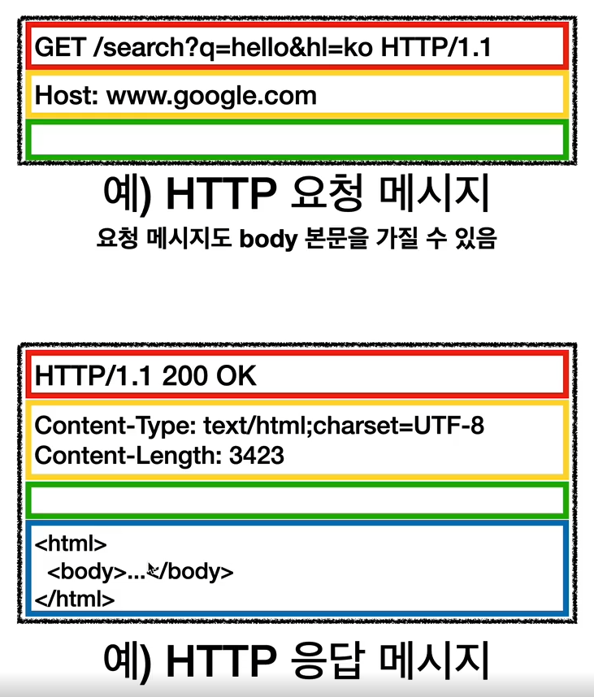
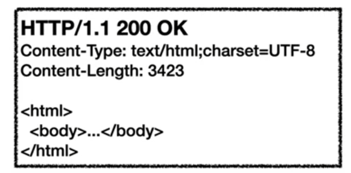

# 3. HTTP 기본
### 3.1. 모든 것이 HTTP
- 거의 모든 형태의 데이터를 전송 가능하다.
- 현재는 HTTP/1.1 을 주로 사용한다.

특징
- 클라이언트 서버 구조
- stateless
- connectionless
- http message
- 단순함, 확장 가능

### 3.2. 클라이언트 서버 구조
- request, response 구조이다.
- 클라이언트는 서버에 요청을 보내고 응답을 대기
- 서버가 요청에 대한 결과를 만들어 응답

### 3.3. stateful, stateless
stateful 
- 중간에 다른 서버로 바뀌면 안된다.

stateless
- http 는 stateless 하다.
- 중간에 다른 서버로 바뀌어도 된다.
- 스케일 아웃이 용이하다.

하지만 로그인과 같이 상태를 유지해야하는 경우에 브라우저 쿠키와 서버 세션을 사용해 상태를 유지할 수 있다.  
어쩔 수 없이 한계가 있다.  
꼭 필요한 경우에만 최소한으로 사용해야한다.  

### 3.4. 비 연결성 (connectionless)
장점
- 연결을 유지하지 않으면 서버의 자원을 최소한으로 유지할 수 있다.
- HTTP는 기본이 연결을 유지하지 않는 모델이다.
- 일반적으로 초단위 이하의 빠른 속도로 응답한다.
- 1시간동안 수천명이 서비스를 사용해도 실제 서버에 동시에 처리하는 요청은 수십개이하로 매우 적다.
- 서버 자원을 매우 효율적으로 사용할 수 있다.

한계와 극복
- TCP/IP 연결을 새로 맺어야한다. (3 way handshake)
- 웹 브라우저로 사이트를 요청하면 HTML 뿐만 아니라 js, css, img 등 수많은 자원이 함께 다운로드된다.
- 지금은 HTTP 지속연결(Persistent Connections) 로 문제 해결한다.
- HTTP/2, HTTP/3 에서 더 많은 최적화가 되었다.

지속연결
- 리소스를 모두 다운받을때까지 일정시간 연결해 연결에 필요한 리소스를 줄인다.
- HTTP/3 에서는 UDP로 연결도 더 개선했다.

### 3.5. HTTP 메시지
  
메시지 구조는 시작라인, 헤더, 공백라인, 바디로 구성되어 있다.

  
요청 메시지와 응답 메시지는 위와 같고, 요청 메시지도 body를 가질 수 있다.  

요청 메시지  
  
- 시작라인 : GET, POST 등과 같은 메서드, 절대경로와 쿼리, http 버전이 들어간다.
- 헤더 : 호스트가 들어가는데 호스트와 콜론은 붙인다.

응답 메시지  
  
- 시작 라인 : http 버전, http 상태코드가 들어간다.
- 헤더 : http 전송에 필요한 모든 부가정보(메시지 바디 내용, 메시지 바디 크기, 압축, 인증, 요청 클라이언트 정보, 서버 애플리케이션 정보, 캐시 관리 정보 등등)
- 표준헤더가 너무 많음
- 바디 : 실제 전송할 데이터(문서, 영상, 이미지, json 등등)
