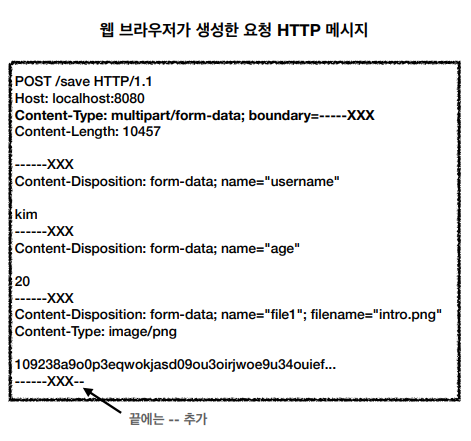

# 5. HTTP 메서드 활용
### 5.1. 클라이언트에서 서버로 데이터 전송
데이터 전달 방식은 크게 2가지
- 쿼리 파라미터를 통한 데이터 전송
  - get
  - 주로 정렬 필터(검색어)
- 메시지 바디를 통한 데이터 전송
  - post, put, patch
  - 회원가입, 상품 주문, 리소스 등록, 리소스 변경

4가지 상황
- 정적 데이터 조회
  - 쿼리 파라미터 미사용
  - 이미지, 정적 텍스트 문서
  - 조회는 get 사용
  - `/static/star.jpg`
- 동적 데이터 조회
  - 쿼리 파라미터 사용
  - 주로 검색, 게시판 목록에서 정렬 필터(검색어)
  - 조회 조건을 줄여주는 필터, 조회 결과를 정렬하는 정렬 조건에 주로 사용
  - 조회는 get 사용
  - `/search?q=hello&hl=ko`
- HTML Form 데이터 전송
  - form 전송은 GET, POST 만 지원
  - HTML Form 은 GET 전송도 가능
  - Content-Type : application/x-www-form-urlencoded
    - form 내용을 메시지 바디를 통해서 전송(key=value, 쿼리 파라미터 형식)
    - 전송 데이터를 url encoding 처리
    - POST 이면 바디에 추가되어 전송됨
    - GET 이면 쿼리파라미터로 전용됨
  - Content-Type : multipart/form-data
    - boundry로 구분되어 전송됨
    - 

### 5.1. HTTP API 설계 예시
회원 관리 시스템
- API 설계 - POST 기반 등록
  - 회원목록 : `/members` -> GET
  - 회원등록 : `/members` -> POST
  - 회원조회 : `/members/{id}` -> GET
  - 회원수정 : `/members/{id}` -> PATCH, PUT, POST
  - 회원삭제 : `/members/{id}` -> DELETE
  - POST 신규 자원 등록 특징
    - 클라이언트는 등록될 리소스의 URI를 모른다.
      - `/members` -> POST
    - 서버가 새로 등록된 리소스 URI를 생성해준다.
      - Location: `/members/100`
    - 컬렉션(Collection)

파일 관리 시스템
- API 설계 - PUT 기반 등록
  - 파일목록 : `/files` -> GET
  - 파일조회 : `/files/{filename}` -> GET
  - 파일등록 : `/files/{filename}` -> PUT
  - 파일삭제 : `/files/{filename}` -> DELETE
  - 파일대량등록 : `/files` -> POST
  - PUT 신규 자원 등록 특징
    - 클라이언트가 리소스 URI를 알고 있어야한다.
      - `/files/{filename}` -> PUT
    - 클라이언트가 직접 리소스의 URI를 지정한다.
    - 스토어(Store)

참고하면 좋은 URI 설계 개념
- 문서(document)
  - 단일 개념
  - `/members/100`, `/files/star.jpg`
- 컬렉션(collection)
  - 서버가 관리하는 리소스 디렉터리
  - 서버가 리소스의 URI를 생성하고 관리
  - `/members`
  - 대부분 스토어 사용
- 스토어(Store)
  - 클라이언트가 관리하는 저장소
  - 클라이언트가 리소스의 URI를 알고 관리
  - `/files`
- 컨트롤러(controller), 컨트롤 URI
  - 문서, 컬렉션, 스토어로 해결하기 어려운 추가 프로세스 실행
  - 동사를 직접 사용
