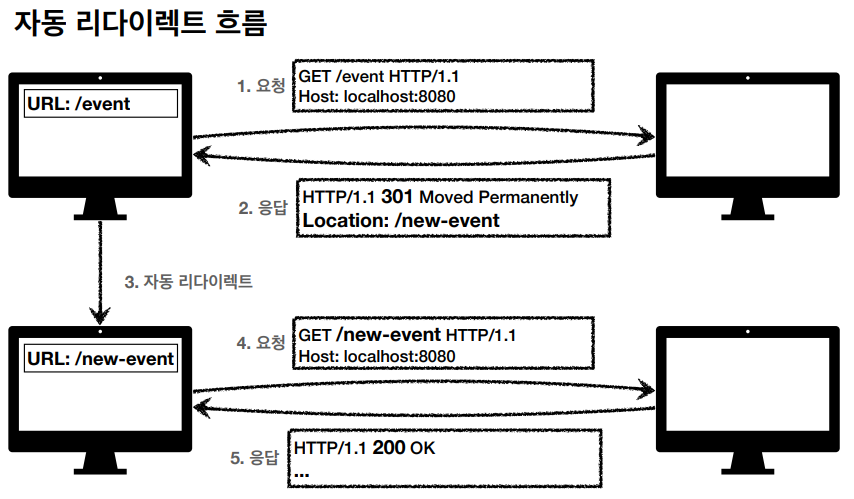
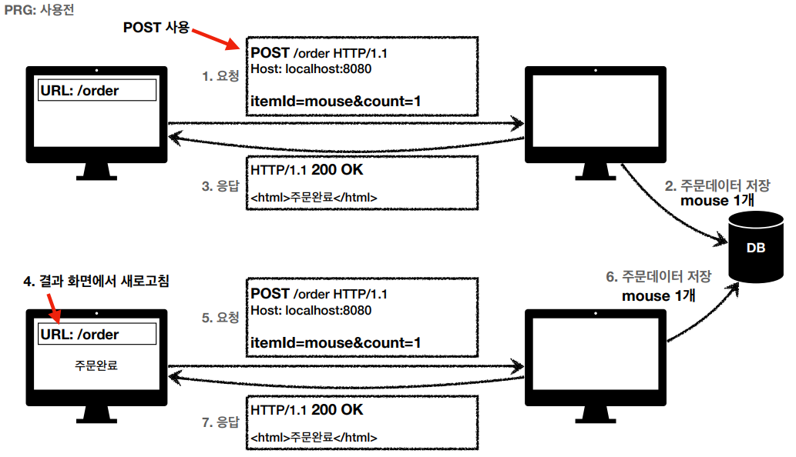
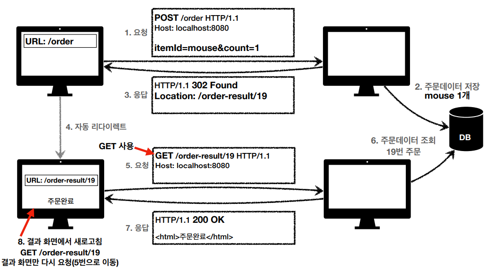

# 6. HTTP 상태코드
### 6.1. HTTP 상태코드 소개
클라이언트가 보낸 요청의 처리 상태를 응답에서 알려주는 기능
- 1xx(Informational) : 요청이 수신되어 처리중 (거의 사용하지 않으므로 생략)
- 2xx(Successful) : 요청 정상 처리
- 3xx(Redirection) : 요청을 완료하려면 추가 행동이 필요
- 4xx(Client Error) : 클라이언트 오류, 잘못된 문법 등으로 서버가 요청을 수행할 수 없음
- 5xx(Server Error) : 서버 오류, 서버가 정상 요청을 처리하지 못함

### 6.2. 2xx - 성공
- 200 OK
- 201 Created : 요청 성공해서 새로운 리소스가 생성됨
- 202 Accepted : 요청이 접수되었으나 처리가 완료되지 않았음 (배치 처리 등 일괄처리에서 사용)
- 204 No Content : 서버가 요청을 성공적으로 수행했지만, 응답 페이로드 본문에 보낼 데이터가 없음

200만 사용하는 경우도 많다.  
다 사용 한다고 좋은것은 아니다.

### 6.3. 3xx - 리다이렉션1
요청을 완료하기 위해 유저 에이전트의 추가 조치 필요  

리다이렉션 이해
- 웹브라우저는 3xx 응답의 결과에 Location 헤더가 있으면 Location 위치로 자동 이동(리다이렉트)
- 종류
  - 영구 리다이렉션 : 특정 리소스의 URI가 영구적으로 이동
    - /members -> /users
    - /event -> /new-event
  - 일시 리다이렉션 : 일시적인 변경
    - 주문 완료 후 주문 내역 화면으로 이동
    - RPG : Post/Redirect/Get
  - 특수 리다이렉션
    - 결과 대신 캐시를 사용

301, 308 - 영구 리다이렉션
- 리소스의 URI가 영구적으로 이동
- 원래의 URL을 사용 못함
- 검색 엔진 등에서도 변경 인지
- 301 Moved Permanently
  - 리다이렉트시 요청 메서드가 GET으로 변하고 본문이 제거될 수 있음  
    
- 308 Permanent Redirect
  - 301과 기능은 같음
  - 리다이렉트 요청 메서드와 본문 유지(처음 POST를 보내면 리다이렉트 모두 유지)
  - 실제로는 내부적으로 전달해야하는 정보들이 다 바뀌기 때문에 301을 거의 사용한다  
    

### 6.4. 3xx - 리다이렉션2
302, 307, 303 - 일시적 리다이렉션
- 리소스의 URI가 일시적으로 변경
- 따라서 검색 엔진 등에서 URL을 변경하면 안됨
- 302 Found
  - 리다이렉트시 요청 메서드가 GET으로 변하고 본문이 제거될 수 있음
- 307 Temporary Redirect
  - 302와 기능은 같음
  - 리다이렉트시 요청메서드와 본문 유지
- 303 See Other
  - 302와 기능은 같음
  - 리다이렉트시 요청 메서드가 GET으로 변경

PRG: Post/Redirect/Get
- POST로 주문후에 웹 브라우저를 새로고침하면
- 새로고침은 다시요청
- 중복주문이 될 수 있다  
  
- POST로 주문후에 새로고침으로 인한 중복 주문 방지
- POST로 주문후에 주문 결과 화면을 GET 메서드로 리다이렉트
- 새로고침해도 결과 화면을 GET으로 조회
- 중복 주문 대신에 결과 화면만 GET으로 다시 요청  
  
- PRG 이후 리다이렉트
  - URL이 이미 POST->GET으로 리다이렉트 됨
  - 새로 고침 해도 GET으로 결과 화면만 조회

그래서 뭘 써야 하나요?
- 처음 302 스펙의 의도는 HTTP 메서드를 유지하는것
- 그런데 웹 브라우저들이 대부분 GET으로 바꾸어버림
- 그래서 모호한 302를 대신하는 명확한 307, 303이 등장함
- 현실은 307, 303을 권장하지만 현실적으로 많은 애필리케이션 라이브러리들이 302를 기본값으로 사용
- 자동 리다이렉션시에 GET으로 변해도 되면 그냥 302를 사용해도 큰 문제 없음

300, 304 - 기타 리다이렉션
- 300 Multiple Choice : 안쓴다
- 304 Not Modified
  - 많이 쓴다.
  - 캐시를 목적으로 사용
  - 클라이언트에게 리소스가 수정되지 않았음을 알려준다. 따라서 클라이언트는 로컬PC에 저장된 캐시를 재사용한다. (캐시로 리다이렉트한다.)
  - 304 응답은 응답에 메시지 바디를 포함하면 안된다. (로컬 캐시를 사용해야 하므로)
  - 조건부 GET, HEAD 사용

### 6.5. 4xx - 클라이언트 오류
오류의 원인이 클라이언트에 있음
- 400 Bad Request : 클라이언트가 잘못된 요청을 해서 서버가 요청을 처리할 수 없음
  - 요청 구문, 메시지 등등 오류
  - 클라이언트는 요청 내용을 다시 검토하고 보내야함
- 401 Unauthorized : 클라이언트가 해당 리소스에 대한 인증이 필요함
  - 인증되지 않음
  - 401 오류 발생시 응답에 WWW-Authenticate 헤더와 함께 인증 바업을 설명
  - 오류메시지가 Unauthorized이지만 인증되지 않음임
- 403 Forbidden : 서버가 요청을 이해했지만 승인을 거부함
  - 주로 인증 자격 증명은 있지만 접근 권한이 불충분한 경우
- 404 Not Found : 요청 리소스를 찾을 수 없음
  - 요청 리소스가 서버에 없음
  - 또는 클라이언트가 권한이 부족한 리소스에 접근할 때 해당 리소스를 숨기고 싶을 때

### 6.6. 5xx - 서버 오류
서버 문제로 오류 발생  
서버에 문제가 있기 때문에 재시도 하면 성공할 수도 있음(복구가 되거나 등등)
- 500 Internal Server Error : 서버 문제로 오류 발생, 애매하면 500 오류
- 503 Service Unavailable : 서비스 이용 불가

5xx 에러는 진짜 서버에 문제가 있을 때 발생시켜야한다.  
크리티컬한 에러로 내야한다.  
20세 이상에게 제공하는 서비스인데 15세가 접근한다는것은 정상적인 로직이므로 서버에러로 내면 안된다.