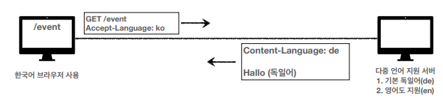

# 7. HTTP 헤더1 - 일반 헤더
### 7.1. HTTP 헤더 개요
헤더의 용도 : HTTP 전송에 필요한 모든 부가정보  

  
현재의 헤더
- 메시지 본문(message body)을 통해 표현 데이터 전달
- 메시지 본문 = 페이로드(payload)
- 표현은 요청이나 응답에서 전달할 실제 데이터
- 표현 헤더는 표현 데이터를 해석할 수 있는 정보 제공
- 데이터 유형(html, json), 데이터 길이, 압축정보 등등

### 7.2. 표현

표현
- Content-Type : 표현 데이터의 형식
- Content-Encoding : 표현 데이터의 압축 방식
- Content-Language : 표현 데이터의 자연 언어
- Content-Length : 표현 데이터의 길이

Content-Type : 표현 데이터의 형식 설명
- text/html;charset=utf-8
- application/json
- image/png

Content-Encoding : 표현 데이터 인코딩
- 표현 데이터를 압축하기 위해 사용
- 데이터를 전달하는 곳에서 압축 후 인코딩 헤더 추가
- 데이터를 읽는 쪽에서 인코딩 헤더의 정보로 압축 해제
- gzip, deflate, identity

Content-Language : 표현 데이터의 자연언어
- ko, en, en-US

Content-Length : 표현 데이터의 길이
- 바이트 단위
- Transfer-Encoding(전송 코딩)을 사용하면 content-Length를 사용하면 안됨

### 7.3. 콘텐츠 협상 (Content negotiation)
클라이언트가 선호하는 표현 요청
- Accept: 클라이언트가 선호하는 미디어 타입 전달
- Accept-Charset: 클라이언트가 선호하는 문자 인코딩
- Accept-Encoding: 클라이언트가 선호하는 압축 인코딩
- Accept-Language: 클라이언트가 선호하는 자연 언어
- 협상 헤더는 요청시에만 사용

적용전  
기본이 영어이면 영어 전달  
  

적용후  
영어와 한국어를 모두 지원하기 때문에 ko를 요청하면 한국어로 전달  
  

복잡한 예시  
영어와 독일어만 지원하기때문에 ko는 없어 기본인 독일어 전달
이런경우를 위해 우선순위가 필요함
  

우선순위  
우선순위에 따라 영어를 보내줌  

또 다른 우선순위  
구체적인것이 우선한다  

### 7.4. 전송 방식
- 단순 전송 : Content-Length를 지정함
  

- 압축 전송 : 압축해서 전송함
  

- 분할 전송 : 청크 단위로 분할해서 보냄. Content-Length를 보내면 안된다.
  

- 범위 전송  
  
  
### 7.5. 일반 정보
- From : 유저 에이전트의 이메일 정보
  - 일반적으로 잘 사용되지 않음
  - 검색엔진 같은 곳에서 주로 사용
  - 요청에서 사용
- Referer
  - 이전 웹 페이지 주소
  - A -> B로 이동하는 경우 B를 요청할 때 Referer: A를 포함해서 요청 
  - Referer를 사용해서 유입 경로 분석 가능
  - 요청에서 사용
  - referrer의 오타임
- User-Agent : 클라이언트 애플리케이션 정보
  - 특정 브라우저에서 장애가 발생하는지 파악 가능
  - 통계정보
  - 요청에서 사용
- Server : 요청을 처리하는 origin 서버의 소프트웨어 정보
  - server: nginx
  - 응답에서 사용
- Date : 메시지가 발생한 날짜와 시간
  - 응답에서 사용

### 7.6. 특별한 정보
- Host : 요청한 호스트 정보(도메인)
  - 요청에서 사용
  - 필수
  - 하나의 서버가 여러 도메인을 처리해야 할 때 
  - 하나의 IP 주소에 여러 도메인이 적용되어 있을 때
  
- Location : 페이지 리다이렉션
  - 웹 브라우저는 3xx 응답의 결과에 Location 헤더가 있으면, Location 위치로 자동 이동 (리다이렉트)
  - 201 (Created): Location 값은 요청에 의해 생성된 리소스 URI
  - 3xx (Redirection): Location 값은 요청을 자동으로 리디렉션하기 위한 대상 리소스를 가리킴
- Allow : 허용 가능한 HTTP 메서드
  - 405(Method Not Allowed) 에서 응답에 포함해야함
  - Allow : GET, HEAD, PUT
- Retry-After : 유저 에이전트가 다음 요청을 하기까지 기다려야 하는 시간
  - 503 : 서비스가 언제까지 불능인지 알려줄 수 있음
  - 실제로 사용하기 쉽지 않다.

### 7.7. 인증 
- Authorization : 클라이언트 인증 정보를 서버에 전달

### 7.8. 쿠키
- Set-Cookie : 서버에서 클라이언트로 쿠키 전달(응답)
- Cookie : 클라이언트가 서버에서 받은 쿠키를 저장하고 HTTP  요청시 서버로 전달
- Stateless
  - HTTP는 stateless 프로토콜이다.
  - 클라이언트와 서버가 요청과 응답을 주고받으면 연결이 끊어진다.
  - 클라이언트가 다시 요청하면 서버는 이전 요청을 기억하지 못한다.
  - 클라이언트와 서버는 서로 상태를 유지하지 않는다.
- 쿠키를 사용하지 않으면 모든 요청과 링크에 사용자 정보를 포함해야한다.  
  
- 쿠키는 모든 요청에 정보를 자동포함한다.
- 사용처
  - 로그인 세션 관리
  - 광고 정보 트래킹
- 쿠키 정보는 항상 서버에 전송됨
  - 네트워크 트래픽 추가 유발
  - 최소한의 정보만 사용(세션 id, 인증 토큰)
  - 서버에 전송하지 않고 웹 브라우저 내부에 데이터를 저장하고 싶으면 웹 스토리지 참고
- 민감 데이터는 저장하면 안됨(주민번호, 신용카드 번호 등등)
- 생명주기
  - 세션쿠키 : 만료 날짜를 생략하면 브라우저 종료시 까지만 유지
  - 영속쿠키 : 만료 날짜를 입력하면 해당 날짜까지 유지
- 도메인
  - 명시한 문서 기준 도메인 + 서브 도메인 포함
    - domain=example.org를 지정해서 쿠키 생성
      - example.org는 물론이고
      - dev.example.org도 쿠키 접근
  - 생략 : 현재 문서 기준 도메인만 적용
    - example.org 에서 쿠키를 생성하고 domain 지정을 생략
      - example.org 에서만 쿠키 접근
      - dev.example.org는 쿠키 미접근
- 경로
  - 이 경로를 포함한 하위 경로 페이지만 쿠키 접근 가능
  - 일반적으로 path=/ 루트로 지정
    - path=/home 지정
    - /home -> 가능
    - /home/level1 -> 가능
    - /home/level1/level2 -> 가능
    - /hello -> 불가능
- 보안 : Secure, HttpOnly, SameSite
  - Secure
    - 쿠키는 http, https를 구분하지 않고 전송
    - Secure를 적용하면 https인 경우에만 전송
  - HttpOnly
    - XSS 공격 방지
    - 자바스크립트에서 접근 불가(document.cookie)
    - HTTP 전송에만 사용
  - SameSite
    - XSRF 공격 방지
    - 요청 도메인과 쿠키에 설정된 도메인이 같은 경우만 쿠키 전송
