# 1. 인터넷 네트워크

인터넷 통신은 어떻게 가능한것일까?  
어떻게 목적지까지 정확하게 도달할 수 있을까?

### 1.1. IP
클라이언트와 서버는 각각 IP 주소를 가진다.  
패킷에 클라이언트와 서버의 IP가 있어 서로 목적지까지 도달할 수 있다.

하지만 IP의 한계가 있다.
- 비연결성 : 패킷을 받을 대상이 없거나 서비스 불능 상태여도 패킷이 전송된다.
- 비신뢰성 : 패킷중간에 사라지거나 패킷이 순서대로 오지 않을 수 있다.
- 프로그램 구분 : 게임하면서 음악을 듣는것처럼 같은 IP를 사용하는 서버에서 통신하는 애플리케이션이 둘 이상이라면 구분할 수 없다.

```
L3인 Network Layer에서는 MTU(Maximum Transmission Unit)를 설정한다.
일반적으로 이더넷이 L3 에서 주로 사용되기에, 이더넷 기준으로는 MTU는 1500 바이트이다.
여기서 IP헤더와 TCP헤더 각 20바이트를 제외하면 1460 byte 이다.
그래서 MSS(Maximum Segment Size)는 1460 byte 이다.
```
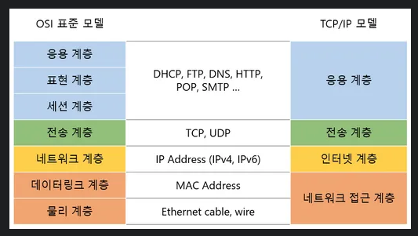


### 1.2. TCP/UDP
TCP(Transmission Control Protocol) : 전송 제어 프로토콜로 말 그대로 전송을 제어한다.
- 연결 지향 (3way handshake)
- 데이터 전달 보장
- 순서 보장
- 신뢰성
- 현재는 대부분 TCP 사용

3 way handshake & 4 way handshake  
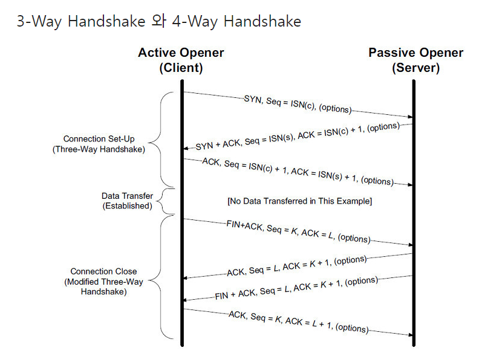

UDP(User Datagram Protocol)
- 기능이 거의 없음
- 연결 지향도 아님
- 데이터 전달 보장도 아님
- 순서도 보장하지 않음
- 하지만 단순하고 빠름
- 정리하면 IP와 거의 같고 port와 체크섬 정도만 추가됨
- 애플리케이션에서 추가 작업이 필요함

### PORT
IP는 목적지 서버를 찾는것  
PORT는 서버 안에서 돌아가는 애플리케이션을 찾는것
- 0 ~ 65535 까지 할당 가능
- 0 ~ 1023 까지는 잘 알려진 포트로 사용하지 않는것이 좋다.
  - FTP : 20, 21
  - TELNET : 23
  - HTTP : 80
  - HTTPS : 443

### DNS(Domain Name System)
도메인 명과 IP 주소를 매핑해준다.

---
# 2. URI와 웹 브라우저 요청 흐름
### 2.1. URI
- URI(Uniform Resource Identifier) : URL + URL  
- URL(Uniform Resource Locator) : 리소스가 있는 위치를 지정   
- URN(Uniform Resource Identifier) : 리소스에 이름을 부여  
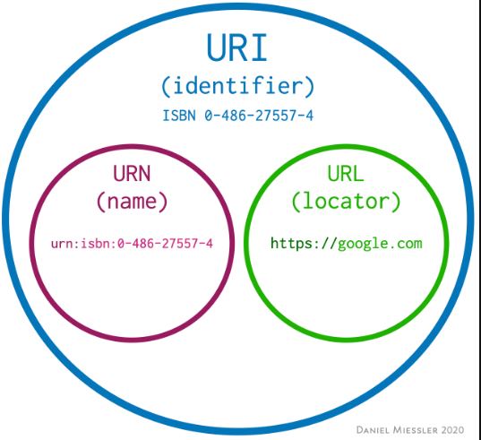

URI 구성 요소  
https://www.google.com:443/search?q=hello&hl=ko 를 예로 들면  
- scheme : https
- host : www.google.com
- port : 443
- path : /search
- query : ?q=hello&hl=ko
- fragment : html 내부 북마크 등에 사용되고 서버에 전송하는 정보는 아니다. 

### 2.2. 웹 브라우저 요청 흐름
- HTTP 메시지를 TCP/IP 패킷으로 감싸고 보낸다.
- 서버에서 패킷을 까고 요청을 다시 전달한다.
- 클라이언트에서 패킷을 까고 확인한다.

---
# 3. HTTP 기본
### 3.1. 모든 것이 HTTP
- 거의 모든 형태의 데이터를 전송 가능하다.
- 현재는 HTTP/1.1 을 주로 사용한다.

특징
- 클라이언트 서버 구조
- stateless
- connectionless
- http message
- 단순함, 확장 가능

### 3.2. 클라이언트 서버 구조
- request, response 구조이다.
- 클라이언트는 서버에 요청을 보내고 응답을 대기
- 서버가 요청에 대한 결과를 만들어 응답

### 3.3. stateful, stateless
stateful 
- 중간에 다른 서버로 바뀌면 안된다.

stateless
- http 는 stateless 하다.
- 중간에 다른 서버로 바뀌어도 된다.
- 스케일 아웃이 용이하다.

하지만 로그인과 같이 상태를 유지해야하는 경우에 브라우저 쿠키와 서버 세션을 사용해 상태를 유지할 수 있다.  
어쩔 수 없이 한계가 있다.  
꼭 필요한 경우에만 최소한으로 사용해야한다.  

### 3.4. 비 연결성 (connectionless)
장점
- 연결을 유지하지 않으면 서버의 자원을 최소한으로 유지할 수 있다.
- HTTP는 기본이 연결을 유지하지 않는 모델이다.
- 일반적으로 초단위 이하의 빠른 속도로 응답한다.
- 1시간동안 수천명이 서비스를 사용해도 실제 서버에 동시에 처리하는 요청은 수십개이하로 매우 적다.
- 서버 자원을 매우 효율적으로 사용할 수 있다.

한계와 극복
- TCP/IP 연결을 새로 맺어야한다. (3 way handshake)
- 웹 브라우저로 사이트를 요청하면 HTML 뿐만 아니라 js, css, img 등 수많은 자원이 함께 다운로드된다.
- 지금은 HTTP 지속연결(Persistent Connections) 로 문제 해결한다.
- HTTP/2, HTTP/3 에서 더 많은 최적화가 되었다.

지속연결
- 리소스를 모두 다운받을때까지 일정시간 연결해 연결에 필요한 리소스를 줄인다.
- HTTP/3 에서는 UDP로 연결도 더 개선했다.

### 3.5. HTTP 메시지
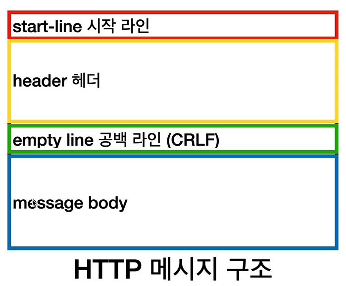  
메시지 구조는 시작라인, 헤더, 공백라인, 바디로 구성되어 있다.


  
요청 메시지와 응답 메시지는 위와 같고, 요청 메시지도 body를 가질 수 있다.  

요청 메시지  
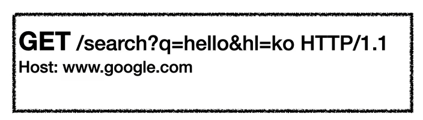  
- 시작라인 : GET, POST 등과 같은 메서드, 절대경로와 쿼리, http 버전이 들어간다.
- 헤더 : 호스트가 들어가는데 호스트와 콜론은 붙인다.

응답 메시지  
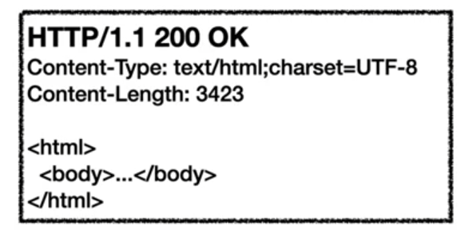  
- 시작 라인 : http 버전, http 상태코드가 들어간다.
- 헤더 : http 전송에 필요한 모든 부가정보(메시지 바디 내용, 메시지 바디 크기, 압축, 인증, 요청 클라이언트 정보, 서버 애플리케이션 정보, 캐시 관리 정보 등등)
- 표준헤더가 너무 많음
- 바디 : 실제 전송할 데이터(문서, 영상, 이미지, json 등등)

---
# 4. HTTP 메서드
### 4.1. HTTP API를 만들어보자
- 회원을 등록하고 수정하고 조회하는게 리소스가 아니라 회원 자체가 리소스이다.
- http 메서드로 행위를 구분하므로 URI는 리소스만 식별하면 된다.
- 그래서 멤버 삭제도, 수정도, 등록도, 조회도 모두 `/member` 이렇게 하면된다.

### 4.2. HTTP 메서드 - GET, POST
- GET : 리소스 조회
  - 서버에 전달하고 싶은 데이터는 쿼리 파라미터를 통해 전달
  - body를 사용할 수 있지만 권장하지않음
- POST : 요청 데이터 처리, 주로 등록에 사용
  - 새 리소스 생성, 등록
  - 요청 데이터 처리 (새로운 리소스가 생성되지 않을 수 있음)
  - json으로 조회 데이터를 넘겨야 하는데 get 메서드를 사용하기 어려운 경우 

### 4.3. HTTP 메서드 - PUT, PATCH, DELETE, 기타
- PUT : 리소스를 대체, 해당 리소스가 없으면 생성
  - 리소스가 있으면 대체, 없으면 생성, 쉽게 이야기해서 덮어버림
  - put은 부분 변경이 불가능하다. 그래서 patch가 나왔다.
- PATCH : 리소스 부분 변경
- DELETE : 리소스 삭제
- HEAD : GET과 동일하지만 메시지 부분을 제외하고, 상태 줄과 헤더만 반환
- OPTIONS : 대상 리소스에 대한 통신 가능 옵션을 설명(주로 CORS에서 사용)

### 4.4. HTTP 메서드의 속성
- 안전
  - 호출해도 리소스를 변경하지 않는다.
  - get, head는 안전하다.
  - get을 계속 호출해서 로그가 쌓여도 안전은 해당 리소스만 고려한다. 그런부분까지 고려하지 않는다.
- 멱등
  - 몇번을 호출하든 결과가 같다.
  - get : 몇번을 조회하든 같은 결과가 조회된다.
  - put : 결과를 대체한다. 같은걸 여러번 요청해도 최종 결과는 같다.
  - delete : 결과를 삭제한다. 같은걸 여러번 요청해도 최종 결과는 같다.
  - post : 멱등이 아니다. 결제를 두번 호출하면 두번 결제가 된것이다.
  - 중간에 데이터가 변경되어 조회 중간에 값이 바뀌어도 멱등이다. 멱등은 외부 요인으로 중간에 리소스가 변경되는 것 까지는 고려하지 않는다.
- 캐시가능
  - get, head, post, patch 캐시가능
  - 실제로는 get, head 정도만 캐시로 사용
  - post, patch는 본문 내용까지 캐시 키로 고려해야하는데 구현이 쉽지않음

---
# 5. HTTP 메서드 활용
### 5.1. 클라이언트에서 서버로 데이터 전송
데이터 전달 방식은 크게 2가지
- 쿼리 파라미터를 통한 데이터 전송
  - get
  - 주로 정렬 필터(검색어)
- 메시지 바디를 통한 데이터 전송
  - post, put, patch
  - 회원가입, 상품 주문, 리소스 등록, 리소스 변경


4가지 상황 
- 정적 데이터 조회
  - 쿼리 파라미터 미사용
  - 이미지, 정적 텍스트 문서
  - 조회는 get 사용
  - `/static/star.jpg`
- 동적 데이터 조회
  - 쿼리 파라미터 사용
  - 주로 검색, 게시판 목록에서 정렬 필터(검색어)
  - 조회 조건을 줄여주는 필터, 조회 결과를 정렬하는 정렬 조건에 주로 사용
  - 조회는 get 사용
  - `/search?q=hello&hl=ko`
- HTML Form 데이터 전송
  - form 전송은 GET, POST 만 지원
  - HTML Form 은 GET 전송도 가능
  - Content-Type : application/x-www-form-urlencoded
    - form 내용을 메시지 바디를 통해서 전송(key=value, 쿼리 파라미터 형식)
    - 전송 데이터를 url encoding 처리
    - POST 이면 바디에 추가되어 전송됨
    - GET 이면 쿼리파라미터로 전용됨
  - Content-Type : multipart/form-data
    - boundry로 구분되어 전송됨
    - 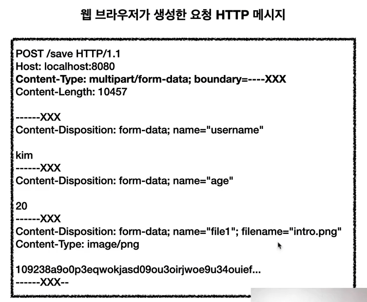


### 5.1. HTTP API 설계 예시
회원 관리 시스템
- API 설계 - POST 기반 등록
  - 회원목록 : `/members` -> GET
  - 회원등록 : `/members` -> POST
  - 회원조회 : `/members/{id}` -> GET
  - 회원수정 : `/members/{id}` -> PATCH, PUT, POST
  - 회원삭제 : `/members/{id}` -> DELETE
  - POST 신규 자원 등록 특징
    - 클라이언트는 등록될 리소스의 URI를 모른다.
      - `/members` -> POST
    - 서버가 새로 등록된 리소스 URI를 생성해준다.
      - Location: `/members/100`
    - 컬렉션(Collection)

파일 관리 시스템
- API 설계 - PUT 기반 등록
  - 파일목록 : `/files` -> GET
  - 파일조회 : `/files/{filename}` -> GET
  - 파일등록 : `/files/{filename}` -> PUT
  - 파일삭제 : `/files/{filename}` -> DELETE
  - 파일대량등록 : `/files` -> POST
  - PUT 신규 자원 등록 특징
    - 클라이언트가 리소스 URI를 알고 있어야한다.
      - `/files/{filename}` -> PUT
    - 클라이언트가 직접 리소스의 URI를 지정한다.
    - 스토어(Store)

참고하면 좋은 URI 설계 개념
- 문서(document)
  - 단일 개념
  - `/members/100`, `/files/star.jpg`
- 컬렉션(collection)
  - 서버가 관리하는 리소스 디렉터리
  - 서버가 리소스의 URI를 생성하고 관리
  - `/members`
  - 대부분 스토어 사용
- 스토어(Store)
  - 클라이언트가 관리하는 저장소
  - 클라이언트가 리소스의 URI를 알고 관리
  - `/files`
- 컨트롤러(controller), 컨트롤 URI
  - 문서, 컬렉션, 스토어로 해결하기 어려운 추가 프로세스 실행
  - 동사를 직접 사용

# 6. HTTP 상태코드
### 6.1. HTTP 상태코드 소개
클라이언트가 보낸 요청의 처리 상태를 응답에서 알려주는 기능
- 1xx(Informational) : 요청이 수신되어 처리중 (거의 사용하지 않으므로 생략)
- 2xx(Successful) : 요청 정상 처리
- 3xx(Redirection) : 요청을 완료하려면 추가 행동이 필요
- 4xx(Client Error) : 클라이언트 오류, 잘못된 문법 등으로 서버가 요청을 수행할 수 없음
- 5xx(Server Error) : 서버 오류, 서버가 정상 요청을 처리하지 못함

### 6.2. 2xx - 성공
- 200 OK
- 201 Created : 요청 성공해서 새로운 리소스가 생성됨
- 202 Accepted : 요청이 접수되었으나 처리가 완료되지 않았음 (배치 처리 등 일괄처리에서 사용)
- 204 No Content : 서버가 요청을 성공적으로 수행했지만, 응답 페이로드 본문에 보낼 데이터가 없음

200만 사용하는 경우도 많다.  
다 사용 한다고 좋은것은 아니다.

### 6.3. 3xx - 리다이렉션1
요청을 완료하기 위해 유저 에이전트의 추가 조치 필요  
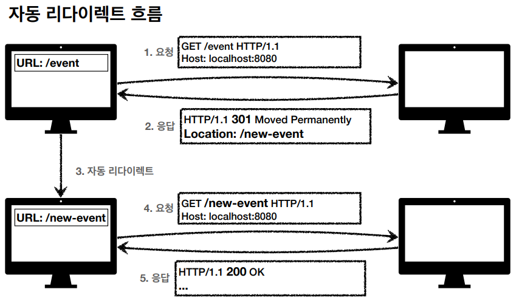

리다이렉션 이해  
- 웹브라우저는 3xx 응답의 결과에 Location 헤더가 있으면 Location 위치로 자동 이동(리다이렉트)
- 종류
  - 영구 리다이렉션 : 특정 리소스의 URI가 영구적으로 이동
    - /members -> /users
    - /event -> /new-event
  - 일시 리다이렉션 : 일시적인 변경
    - 주문 완료 후 주문 내역 화면으로 이동
    - RPG : Post/Redirect/Get
  - 특수 리다이렉션
    - 결과 대신 캐시를 사용

301, 308 - 영구 리다이렉션
- 리소스의 URI가 영구적으로 이동
- 원래의 URL을 사용 못함
- 검색 엔진 등에서도 변경 인지
- 301 Moved Permanently
  - 리다이렉트시 요청 메서드가 GET으로 변하고 본문이 제거될 수 있음  
  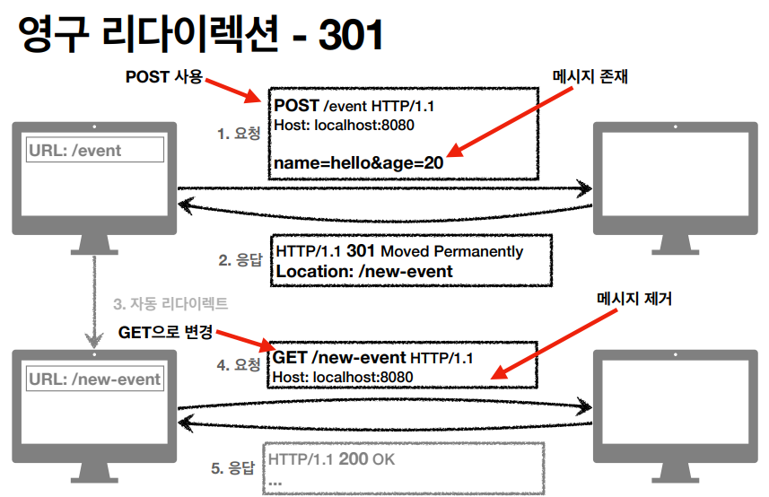
- 308 Permanent Redirect
  - 301과 기능은 같음
  - 리다이렉트 요청 메서드와 본문 유지(처음 POST를 보내면 리다이렉트 모두 유지)
  - 실제로는 내부적으로 전달해야하는 정보들이 다 바뀌기 때문에 301을 거의 사용한다  
  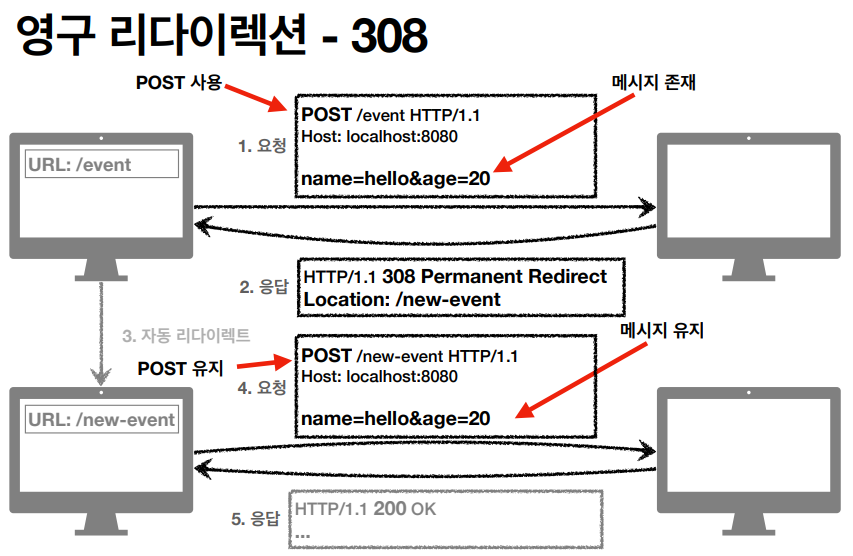

### 6.4. 3xx - 리다이렉션2
302, 307, 303 - 일시적 리다이렉션
- 리소스의 URI가 일시적으로 변경
- 따라서 검색 엔진 등에서 URL을 변경하면 안됨
- 302 Found
  - 리다이렉트시 요청 메서드가 GET으로 변하고 본문이 제거될 수 있음
- 307 Temporary Redirect
  - 302와 기능은 같음
  - 리다이렉트시 요청메서드와 본문 유지
- 303 See Other
  - 302와 기능은 같음
  - 리다이렉트시 요청 메서드가 GET으로 변경

PRG: Post/Redirect/Get
- POST로 주문후에 웹 브라우저를 새로고침하면
- 새로고침은 다시요청
- 중복주문이 될 수 있다  
  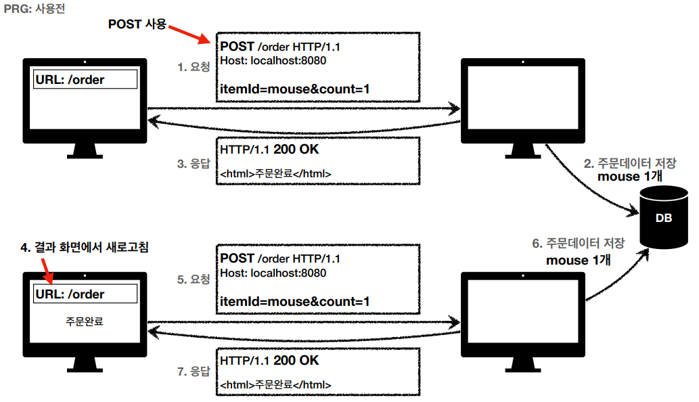
- POST로 주문후에 새로고침으로 인한 중복 주문 방지
- POST로 주문후에 주문 결과 화면을 GET 메서드로 리다이렉트
- 새로고침해도 결과 화면을 GET으로 조회
- 중복 주문 대신에 결과 화면만 GET으로 다시 요청  
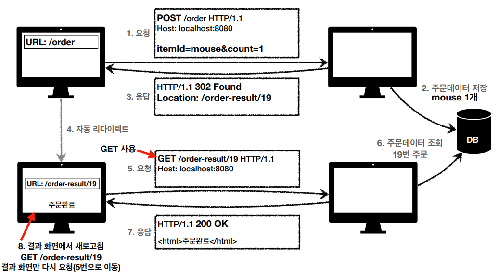
- PRG 이후 리다이렉트
  - URL이 이미 POST->GET으로 리다이렉트 됨
  - 새로 고침 해도 GET으로 결과 화면만 조회

그래서 뭘 써야 하나요?
- 처음 302 스펙의 의도는 HTTP 메서드를 유지하는것
- 그런데 웹 브라우저들이 대부분 GET으로 바꾸어버림
- 그래서 모호한 302를 대신하는 명확한 307, 303이 등장함
- 현실은 307, 303을 권장하지만 현실적으로 많은 애필리케이션 라이브러리들이 302를 기본값으로 사용
- 자동 리다이렉션시에 GET으로 변해도 되면 그냥 302를 사용해도 큰 문제 없음

300, 304 - 기타 리다이렉션
- 300 Multiple Choice : 안쓴다  
- 304 Not Modified
  - 많이 쓴다.
  - 캐시를 목적으로 사용
  - 클라이언트에게 리소스가 수정되지 않았음을 알려준다. 따라서 클라이언트는 로컬PC에 저장된 캐시를 재사용한다. (캐시로 리다이렉트한다.)
  - 304 응답은 응답에 메시지 바디를 포함하면 안된다. (로컬 캐시를 사용해야 하므로)
  - 조건부 GET, HEAD 사용

### 6.5. 4xx - 클라이언트 오류
### 6.6. 5xx - 서버 오류