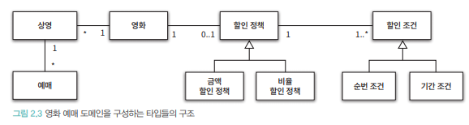
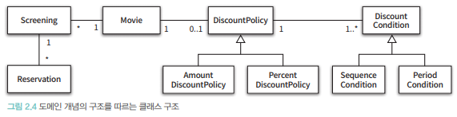

# 2장. 객체지향 프로그래밍

### 영화 예매 시스템 요구사항
```text
1. 영화를 예매할 수 있다.
2. 상영은 영화를 관람 하는 것을 의미한다.
    2.1. 상영에는 날짜, 시간이 있다.
3. 영화 예매자는 할인 받을 수 있다.
    3.1. 할인에는 할인 조건과 할인 정책이 있다.
        3.1.1. 할인 조건에는 순서 조건과 기간 조건이 있다.
            - 순서 조건은 상영 순번을 이용해 할인 여부를 결정하는 규칙이다.
            - 기간 조건은 영화 상영 시작 시간이 해당 기간 안에 포함될 경우 할인된다.
        3.1.2. 할인 정책은 할인 요금을 결정한다. 금액 할인 정책과 비율 정책 할인이 있다.
            - 금액 정책 할인은 일정 금액을 할인해준다.
            - 비율 정책 할인은 일정 비율만큼 할인해준다.
            - 영화별로 하나의 정책만 할당할 수 있다.
            - 정책을 지정하지 않을 수도 있다.
            - 할인 조건은 여러 개 할당할 수 있다.
```

### 객체 설계
  
위 그림은 영화 도메인을 구성하는 개념과 관계를 표현한 것이다.  
영화는 여러번 상영될 수 있고 상영은 여러 번 예매될 수 있다.  
할인정책은 할당하지 않거나 하나만 할당할 수 있다.  
할인 정책이 존재하는 경우는 하나 이상의 할인 조건이 반드시 존재한다는 것을 알 수 있다.

  
위의 원칙에 따라 클래스를 작성해 보자.

### 협력에 관한 이야기
객체가 다른 객체와 상호작용 할 수 있는 유일한 방법은 메시지를 전송하는 것뿐이다.  
다른 객체에게 요청이 도착할 때 메시지를 수신했다고 하고, 수신된 메시지를 처리하는 방법을 메서드라고 한다.
그래서 메서드를 호출한다 보다 메시지를 전송한다가 더 적절한 표현이다.  